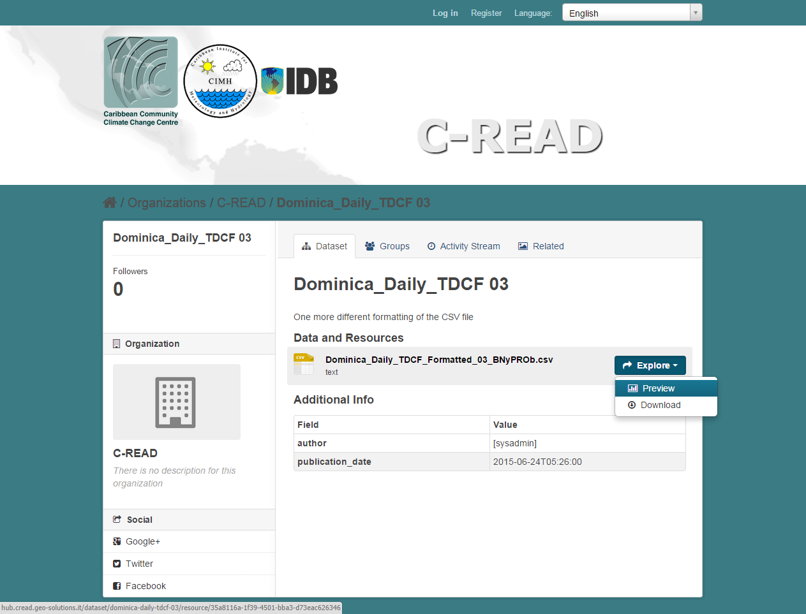
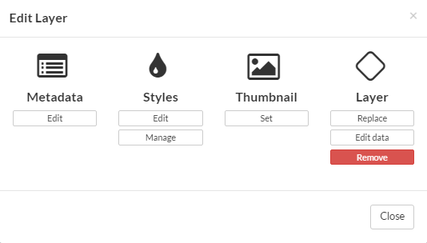
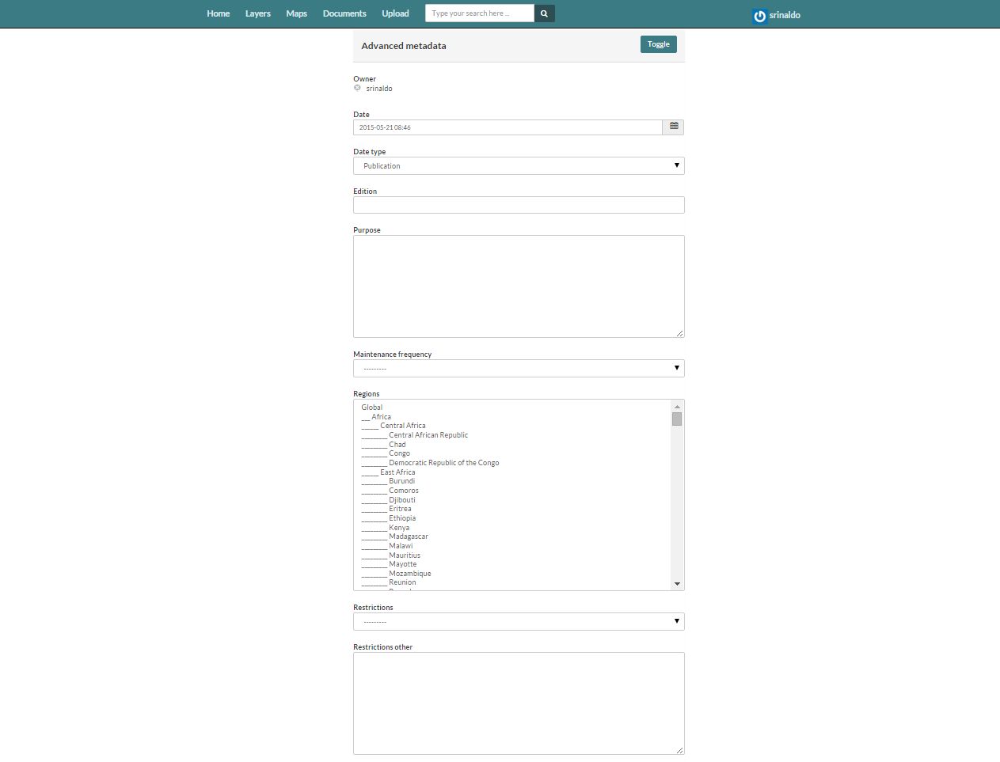

.. _data:

##############
C-READ GeoNode
##############

C-READ GeoNode System is a web-based application platform for developing geospatial information systems (GIS) and for deploying spatial data infrastructures (SDI).
The user interface of C-READ GeoNode System, as well as the hierarchical organization of data, follows this breakdown:

- Category 1: Meteorological and Hydrological Data and Projections
- Category 2: Hazards and Risks
- Category 3: Geographical and Biophysical Risk
- Category 4: Coastal Zone and Ocean
- Category 5: Land Cover and Land Use
- Category 6: Agriculture and Food Security
- Category 7: Water: Availability, Quality, and Use
- Category 8: Energy: Use, Generation, and Availability
- Category 9: Socio-Economic Status
- Category 10: Critical Emergency Infrastructure

.. image:: img/DataCategory.png

C-READ Data category

#######
Preview
#######

The C-READ GeoNode web interface is the primary method of interacting with C-READ GeoNode as a user. From this interface, one can view and modify existing spatial layers and maps, as well as find information on other C-READ GeoNode users.
Without being logged in, you are limited to read-only access of public layers.

============
Data Preview
============

Choose a dataset and click on dataset name. 

.. image:: img/GeoNodeDataPreviewDatasets.png

Click Explore button and choose Preview. Table data could be visualized as: Grid, Graph or Map. 

Scroll down the page toward the bottom to see Additional Information.

.. image:: img/GeoNodeDataPreviewAdditionalInformation.png

===========
Map Preview
===========

After the update, the layer will display in a preview window.

.. image:: img/GeoNodeLayerPreview.png

Layer Detail Tabs
-----------------

1. Scroll down the page toward the bottom. Five tabs are available: Info, Attributes, Share, Ratings, and Comments. The info tab is already highlighted, and presents basic information about the layer, of the kind that was seen on the layer list page.

.. image:: img/GeoNodeLayerInfoTab.png

Layer Info tab

2. Click the Attributes tab. This lists the attributes of the layer, including statistics (range, average, median and standard deviation). Layer attribute statistics are made available only for numeric attributes. As we can see, this layer’s attributes are not numeric, so no statistics are calculated.

.. image:: img/GeoNodeAttributesTab.png

Attributes tab

3. Click the Ratings tab. This tab allows you (and others viewing this page) to rate this layer. Ratings can be based on quality, accuracy, or any other metric. Click on the appropriate star to rate this layer.

.. image:: img/GeoNodeLayerRatingsTab.png

Layer Ratings tab

4. Click the Comments tab. This tab allows you to leave a comment for other viewing this layer.

.. image:: img/GeoNodeLayerCommentsTab.png

Layer Comments tab

##############
Document Types
##############

#########
Searching
#########

################
Creating a Layer
################

Layers are a published resource representing a raster or vector spatial data source. Layers also can be associated with metadata, ratings, and comments.

The C-READ GeoNode web interface is the primary method of interacting with C-READ GeoNode as a user. From this interface, one can view and modify existing spatial layers and maps, as well as find information on other C-READ GeoNode users.
Without being logged in, you are limited to read-only access of public layers.

1. Navigate to your C-READ GeoNode instance, available here:

.. image:: img/C-READ_WelcomePage.png

C-READ GeoNode welcome page

This page shows a variety of information about the C-READ GeoNode instance. At the top of the page is a toolbar showing quick links to view layers, maps, documents (metadata) and a search field. 

2. Click the Layers link in the toolbar to go to the Explore Layers page.
This page shows all layers known to C_READ GeoNode, available in either List or Grid viewing. Layers can be sorted by Most Recent or Most Popular. Also available are a list of categories, with which layers can be connected with.

.. image:: img/C-READ_ExploreLayers.png

Explore Layers page

3. Find a layer and click on its name.

4. A layer viewing page will display, with the layer itself superimposed on a hosted base layer.

======
Upload
======

Upload task can be performed only by the user who have the permission to do it.

1. To add a layer to your account, navigate to the C_READ GeoNode welcome page. 

2. By clicking the Layers link you will be brought to the Layers menu where a new subtoolbar can be seen. This toolbar allows you to Explore, Search and Upload layers.

.. image:: img/C-READ_UpLoadLayers.png

3. Now click Upload Layers and you’ll see the upload form.

.. image:: img/C-READ_UpLoadLayers1.png

4. You have two possibilities to add your files. You can either do that by using drag & drop or you choose to browse them. Be aware that you have to upload a complete set of files, consisting of a shp, a prj, a dbf and a shx file. If one of them is missing, C-READ GeoNode will warn you before you upload them.

5. C-READ GeoNode has the ability to restrict who can view, edit, and manage layers. On the right side of the page you can see the Permission section, where you can limit the access on your layer. Under Who can view and download this data, select Any registered user. This will ensure that anonymous view access is disabled. In the same area, under Who can edit this data, select your username. This will ensure that only you are able to edit the data in the layer.

.. image:: img/C-READ_UpLoadLayersPermission.png

6. To upload data, click the Upload files button at the bottom.

=============
Edit metadata
=============

Edit metadata task can be performed only by the user who have the permission to do it.

1. In the Explore Layer page choose a Layer that you want to edit clicking over the name of layer or in the preview window.  

.. image:: img/C-READ_ExploreLayers.png  

2. In the Edit Layers page click the Edit Layer button.

.. image:: img/C-READ_LayerEditPage.png

Edit Layers page

3. In the Edit Layer window click Edit button under Metadata icon.

Edit Layers window

4. In the Edit Metadata page edit Title, Abstract and Category of selected layer. To edit Advanced Metadata click Toogle button.

.. image:: img/C-READ_EditMetadata.png

Edit Metadata page

5. In the Edit Advanced Metadata page edit the details of selected layer.

Edit Advanced Metadata page

6. To update metadata, click the Update button at the bottom.

==========
Edit style
==========

Edit style task can be performed only by the user who have the permission to do it.

1. In the Explore Layer page choose a Layer that you want to edit clicking over the name of layer or in the preview window.  

2. In the Edit Layers page click the Edit Layer button.

3. In the Edit Layer window click Edit button under Style icon. In this interface is it possible to change the style of layers. C-READ GeoNode allows to edit layer styles graphically, without the need to resort to programming or requiring a technical background.

- This layer has one style and one rule in that style; click the rule (Untitled 1) to select it, and then click on Edit below it; 
- Edit the style, you can choose from simple shapes, add labels, and even adjust the look of the points based on attribute values and scale;
- When done, click Save, then click on the word Layers to return to the layer list.

.. image:: img/C-READ_LayerStyles.png

Layer Styles window

.. image:: img/C-READ_LayerStyles_UserStyle.png

User Styles window

.. image:: img/C-READ_StyleRuleBasic.png

Basic Style Rule window

.. image:: img/C-READ_StyleRuleLabel.png

Labels Style Rule windows

.. image:: img/C-READ_StyleRuleAdvanced.png

Advanced Style Rule windows

4. In the Edit Layer window click Manage button under Style icon.
Manage Styles function allows to assign available style to selected layers.

.. image:: img/C-READ_ManageStyles.png

##############
Creating a map
##############

In C-READ GeoNode System maps are comprised of various layers and their styles. Layers can be both local layers in C-READ GeoNode as well as remote layers either served from other WMS servers or by web service layers such as Google or MapQuest. 
C-READ GeoNode maps also contain other information such as map zoom and extent, layer ordering, and style. 

1. Click the Maps link on the top toolbar. This will bring up the list of maps then click on Create a New Map.

.. image:: img/C-READ_ExploreMaps.png

2. A map composition interface will display. In this interface there is a toolbar, layer list, and map window. The map window contains the MapQuest OpenStreetMap layer by default. There are other service layers available here as well: Bing Aerial With Labels, MapQuest Imagery and OpenStreetMap.

.. image:: img/C-READ_CreateMaps.png

3. Click on the New Layers button and select Add Layers.

.. image:: img/C-READ_AddLayersMaps.png

4. Select layers by clicking and click add Layers to add it to the map. The layers will be added to the map. Click Done (right next to Add Layers at the bottom) to return to the main layers list. The style of added layer could be edited clicking on Layer Style icon.

5. Saving map: click on the Map button in the toolbar, and select Save Map. 

.. image:: img/C-READ_SaveMaps.png

6. Enter a title and abstract for your map. 

7. Click Save. Notice that the link on the top right of the page changed to reflect the map’s name.

###################################
Creating a map using a map template
###################################

###############
Create a mosaic
###############

