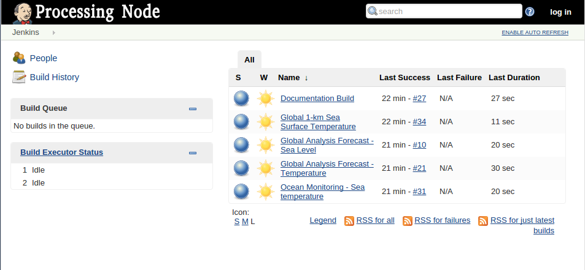
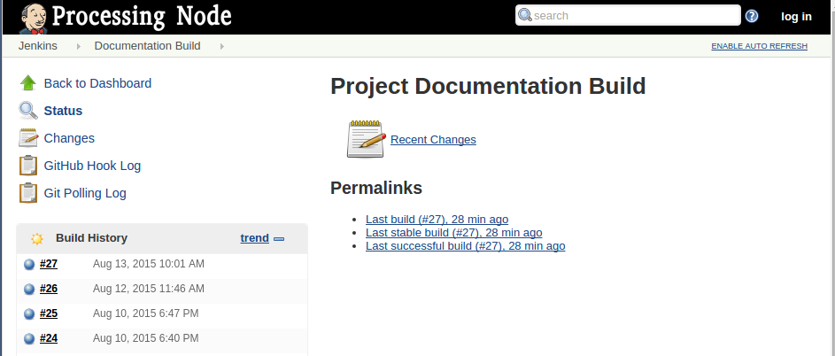
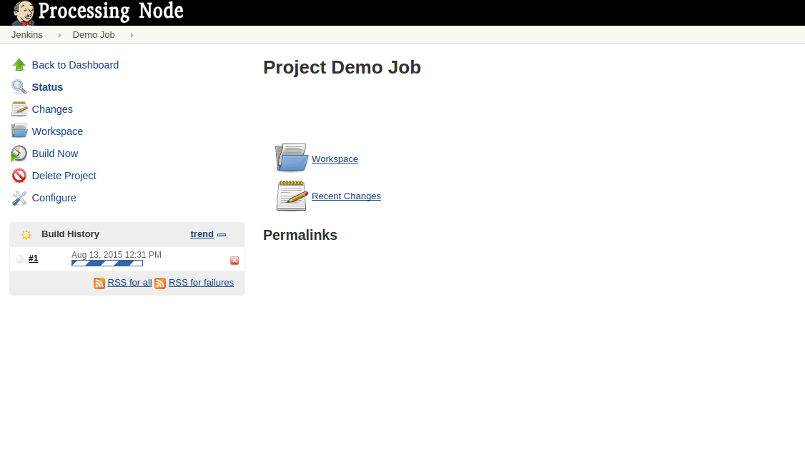

Processing Node
===============

Overview
''''''''

The `C-READ Processing Node` allows users to automate data collection, processing and
uploading on GeoNode.

The execution of tasks is organized in so called called `jobs` that are
executed or `build` by the `Processing Node` periodically or when specific event occurs

Navigate to the C-READ Processing Node home page

In the middle of the page you will see the list of of all configured jobs on the
system. Next to each job you can see information related to it such as last
time it run and the amount of time it took to complete.

In the panel on the left of the screen, the `Build Queue` and `Build Executor Status`
gives you information about the status of the system. Any running and queued jobs
will be listed there.

Clicking on the job name to get more information about the specific job. In the
image below you can see the details of the `Documentation Build` job

In the panel on the left there is the `Build History` with a list of the most recent
builds of the project in chronological order. In the middle of the screen a list
of quick links to relevant builds.

Clicking on a build will bring up the details for the specific build

.. image:: img/processing_node_build_details.png

A blue circle indicates that build was successful, a red circle means that the build
failed for some reason. In the case a build failed refer to the `Console Output` for a more
thorough investigation

Create a new job
''''''''''''''''

To be able to create new jobs you need to be login as administrator first.
Navigate to the Processing Node home page an `log in` as administrator.

Click on `New Item` and fill in the name and type for the new job. we are going
to create a `Freestyle project`. Called `Demo job`.

.. image:: img/processing_node_new_job.png

You will be redirected to configuration page for the new job.

Configuring the new job
'''''''''''''''''''''''

`Project Name` and `Description` are self explanatory. `Discard old builds` allows
you to delete older builds to prevent build data to take up too much the disk space.

In section `Source Code Management` you can configure you connect your build to a
`Revision Control System <https://en.wikipedia.org/wiki/Revision_control>`_ like
`Git <https://it.wikipedia.org/wiki/Git_(software)>`_

In the `Build Triggers` section you configure which events will start a new build
of your project. For example a new build can be triggered by a timer or a change
in a `Git` repository.

The `Build` section is where you configure what your task actually does. Click on
`Add build step`, a drop down menu containing a list of possible actions appears.
In this example we choose `Execute shell`.

Write your own Bash script in the text area or copy the one listed below
::
    #!/bin/bash

    # FTP URL
    ftp_base_URL=ftp://podaac-ftp.jpl.nasa.gov/OceanTemperature/ghrsst/data/L4/GLOB/JPL_OUROCEAN/G1SST/2015/222
	file_name=20150810-JPL_OUROCEAN-L4UHfnd-GLOB-v01-fv01_0-G1SST.nc
	area_of_interest=-115.561581,-2.270676,-40.722711,36.750010

    # Path of processing script inside the repo
    processing_script="./JPL_OUROCEAN-L4UHfnd-GLOB/mosaic_JPL_OUROCEAN-L4UHfnd-GLOB.py"

    # Dimension to extract from NetCDF
    processing_dimension="temperature"

    echo ""

    echo "[INFO] Initiating Download"

    # download it in current folder
    curl -O $ftp_base_URL/$file_name.bz2

    if [ $? -ne 0 ]
    then
    	echo "[ERROR] Downloading file from server"
        exit 1
    fi

    echo "[INFO] Downloading checksum file"
    # also download md5sum
    curl -O $ftp_base_URL/$file_name.bz2.md5
    # check checksum
    if [ $? -ne 0 ]
    then
    	echo "[ERROR] Downloading checksum from server"
        exit 1
    fi

    echo "[INFO] Checking checksum"
    md5sum -c ./$file_name.bz2.md5
    if [ $? -ne 0 ]
    then
    	echo "[ERROR] Checksums do not match, exiting"
        exit 1
    fi

    #extract it
    echo "[INFO] Extracting NetCDF"
    bunzip2 ./$file_name.bz2

    # Process data and upload
    echo "[INFO] Processing granules and uploading to $gs_hostname"
    python2.7 $processing_script ./$file_name $processing_dimension $area_of_interest
    if [ $? -ne 0 ]
    then
    	echo "[ERROR] Processing Failed"
        exit 1
    fi

	# Print informations about the file
    file ./temperature*.tif
    gdalinfo temperature_20150810T000000Z.tif

	# cleanup workspace for next run
	rm ./*.tif ./*.xml ./*.nc

    echo ""

    exit 0

Our example script does the following:
    - Download Python scripts from a Git repository
    - Download a compressed NetCDF file from NASA's JPL FTP server containing observed temperature of the oceans.
    - Download the the file containing the checksum and checks that the file was not corrupted during the download process
    - Extract the NetCDF
    - Invoke a Python script to process the NetCDF, extract the subset of data relevant for us (in this example temperature observations in the Caribbean Sea area) and produce a TIFF image of it
    - Cleanup the workspace for the next run of the job

Run a job
'''''''''
Click on `Build Now` to run it for the first time. Notice in the panel on the left
shows that our new job is now running.

If all goes well, in the `Build History` you'll see an entry labeled `#1` with a
blue circle next to it indicating that the first build of the project went well.

The `Console Output` shows you a log of everything printed out by the job during
its execution.

.. image:: img/processing_node_console_output.png

Cloning a job
'''''''''''''

When creating a new job, instead of starting from scatch you can copy the configuration
of an existing job to use it as a template for our new job.

Select `New Item` in the main menu as you did before, but this time mark `Copy existing item`
and insert the name of the job to copy the configuration from: `Ocean Monitoring - Sea temperature`

Click `Save`

This time the job configuration has been prepopulated with the settings of the job
we copied from.

Scroll down to the build section. This job configuration follows the main structure
of the one in the example above, but it is a bit more articulated.

This job is going to download the data from MyOcean using a python script called
`motu_client` the script takes several parameters in input, including username and
password of the user account, the id of the product to download and other parameters
to filter the data to be downloaded like the region of interest, date and time
::
    #!/bin/bash

    # motu-client script path
    motu_client="./motu-client-python/motu-client.py"
    # username to access download service
    motu_username="xxxxxx"
    # password to access download service
    motu_passwd="xxxxxx"

    # starting date of the data
    motu_start_date=`date --date="2 days ago" +%F`
    # ending date of the data
    motu_end_date=`date --date="2 days ago" +%F`
    # time range
    motu_start_time="00:30:00"
    motu_end_time="23:30:00"

    # coordinates of the region of interest
    motu_x=-115.561581
    motu_X=-40.722711
    motu_y=-2.270676
    motu_Y=36.750010

    # motu-client output folder
    motu_output_dir="output"
    # motu-client output file name
    motu_output_file="METOFFICE-GLO-SST-L4-NRT-OBS-SKIN-DIU.nc"

    motu_url='http://data.ncof.co.uk/mis-gateway-servlet/Motu'
    motu_product_id='http://purl.org/myocean/ontology/service/database#SST_GLO_SST_L4_NRT_OBSERVATIONS_010_014 -d METOFFICE-GLO-SST-L4-NRT-OBS-SKIN-DIU'

    # Path of processing script inside the repo
    processing_script="./SST_GLO_SST_L4_NRT_OBSERVATIONS_010_014/mosaic_METOFFICE-GLO-SST-L4-NRT-OBS-SKIN-DIU.py"
    # Dimension to extract from NetCDF
    processing_dimension="temperature"

    # GeoServer credentials, hostname and destination layer
    gs_username="xxxxxxx"
    gs_passwd="xxxxxxx"
    gs_hostname="data.cread.geo-solutions.it"
    gs_layername="METOFFICE_GLO_SST_L4_NRT_OBS_SKIN_DIU_1438879768913"
    # Delete from Server granules older than #days
    granules_retention=14
    granules_cleanup_script="./evict_mosaic_granules.py"

    # replacing geoserver default username inside the scripts
    sed -i 's/_user[ ]*[=][ ]*.*/_user = '\"$gs_username\"'/g' $processing_script
    sed -i 's/_user[ ]*[=][ ]*.*/_user = '\"$gs_username\"'/g' $granules_cleanup_script

    # replacing geoserver default password inside the scripts
    sed -i 's/_password.*[ ]*[=][ ]*.*/_password = '\"$gs_passwd\"'/g' $processing_script
    sed -i 's/_password.*[ ]*[=][ ]*.*/_password = '\"$gs_passwd\"'/g' $granules_cleanup_script

    # replacing geoserver default URL inside the scripts
    sed -i 's/localhost:8080/'$gs_hostname'/g' $processing_script
    sed -i 's/localhost:8080/'$gs_hostname'/g' $granules_cleanup_script

    # If already run today, fail
    echo "[INFO] Checking whether yesterday's data has already been processed"
    ls ./$processing_dimension_`date --date="1 days ago" +%Y%m%d`*

    if [ $? -eq 0 ]
    then
    	echo "[WARN] Already processed data for $motu_start_date, exiting"
        exit 0
    fi

    # Cleanup workspace
    echo "[INFO] Cleaning up workspace"

    rm -f ./$processing_dimension*.xml
    rm -f ./$processing_dimension*.tif
    rm -f ./$motu_output_dir/$motu_output_file

    echo ""
    echo "[INFO] Downloading data from $motu_start_date at $motu_start_time to $motu_end_date at $motu_end_time"

    # Download NetCDF from server
    mkdir $motu_output_dir 2> /dev/null || true
    echo "Invoking motu-client as follows:"
    echo python2.7 $motu_client -u $motu_username -p _password_hidden -m $motu_url -s $motu_product_id -x $motu_x -X $motu_X -y $motu_y -Y $motu_Y -t "$motu_start_date $motu_start_time" -T "$motu_end_date $motu_end_time" -v sea_ice_fraction -v mask -v analysed_sst -o $motu_output_dir -f $motu_output_file
    python2.7 $motu_client -u $motu_username -p $motu_passwd -m $motu_url -s $motu_product_id -x $motu_x -X $motu_X -y $motu_y -Y $motu_Y -t "$motu_start_date $motu_start_time" -T "$motu_end_date $motu_end_time" -v sea_ice_fraction -v mask -v analysed_sst -o $motu_output_dir -f $motu_output_file
    if [ $? -ne 0 ]
    then
    	echo "[ERROR] Download of NetCDF failed"
        exit 1
    fi

    # Process data and upload
    echo "[INFO] Processing granules and uploading to $gs_hostname"
    python2.7 $processing_script $motu_output_dir/$motu_output_file $processing_dimension $gs_layername
    if [ $? -ne 0 ]
    then
    	echo "[ERROR] Processing Failed"
        exit 1
    fi

    # Remove granules older than $granules_retention from server
    if [ ! -z $gs_layername ]
    then
    	echo "Removing granules older than $granules_retention days from the server"
    	python2.7 $granules_cleanup_script $gs_layername `date -u -d "$granules_retention days ago" +%FT%TZ`
    fi
    echo ""

    exit 0

Replace
motu_username="xxxxxx" and motu_passwd="xxxxxx" with your "MyOcean" account credentials
and gs_username="xxxxxxx" gs_passwd="xxxxxxxxx" with GeoServer administrator credentials

The `gs_layername` variable must contain either the name of the appropriate layer
created uploading a granule on GeoNode as explained in the `Data` section of this
guide or left blank, in which case the new granules will not be uploaded on GeoNode.

Deleting a job
''''''''''''''

Login as administrator and navigate to `Processing Node`'s main page.
Click on the job you would like to delete, then `Delete Project` in the panel on
the left. You'll be prompted for confirmation, then the job will be deleted along
with its workspace and build history.
