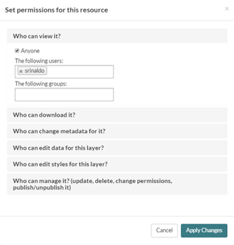

.. _data:

################
Creating a Layer
################

Layers are a published resource representing a raster or vector spatial data source. Layers also can be associated with metadata, ratings, and comments.

The C-READ GeoNode web interface is the primary method of interacting with C-READ GeoNode as a user. From this interface, one can view and modify existing spatial layers and maps, as well as find information on other C-READ GeoNode users.
Without being logged in, you are limited to read-only access of public layers.

1. Navigate to your C-READ GeoNode instance available in the C-READ GeoNode welcome page. This page shows a variety of information about the C-READ GeoNode instance. At the top of the page is a toolbar showing quick links to view layers, maps, documents (metadata) and a search field. :

.. image:: img/C-READ_WelcomePage.png

C-READ GeoNode welcome page

2. Click the Layers link in the toolbar to go to the Explore Layers page.
This page shows all layers known to C_READ GeoNode, available in either List or Grid viewing. Layers can be sorted by Most Recent or Most Popular. Also available are a list of categories, with which layers can be connected with.

.. image:: img/C-READ_ExploreLayers.png

Explore Layers page

3. Find a layer and click on its name.

4. A layer viewing page will display, with the layer itself superimposed on a hosted base layer.

======
Upload
======

Upload task can be performed only by the user who have the permission to do it.

1. To add a layer to your account, navigate to the C_READ GeoNode welcome page.

2. By clicking the Layers link you will be brought to the Layers menu where a new subtoolbar can be seen. This toolbar allows you to Explore, Search and Upload layers.

.. image:: img/C-READ_UpLoadLayers.png

3. Now click Upload Layers and you’ll see the upload form.

.. image:: img/C-READ_UpLoadLayers1.png

4. You have two possibilities to add your files. You can either do that by using drag & drop or you choose to browse them. Be aware that you have to upload a complete set of files, consisting of a shp, a prj, a dbf and a shx file. If one of them is missing, C-READ GeoNode will warn you before you upload them.

5. C-READ GeoNode has the ability to restrict who can view, edit, and manage layers. On the right side of the page you can see the Permission section, where you can limit the access on your layer. Under Who can view and download this data, select Any registered user. This will ensure that anonymous view access is disabled. In the same area, under Who can edit this data, select your username. This will ensure that only you are able to edit the data in the layer.

6. To upload data, click the Upload files button at the bottom.

=============
Edit metadata
=============

Edit metadata task can be performed only by the user who have the permission to do it.

1. In the Explore Layer page choose a Layer that you want to edit clicking over the name of layer or in the preview window.

.. image:: img/C-READ_ExploreLayers.png

2. In the Edit Layers page click the Edit Layer button.

.. image:: img/C-READ_LayerEditPage.png

Edit Layers page

3. In the Edit Layer window click Edit button under Metadata icon.

.. image:: img/C-READ_LayerEditWindow.png

Edit Layers window

4. In the Edit Metadata page edit Title, Abstract and Category of selected layer. To edit Advanced Metadata click Toogle button.

.. image:: img/C-READ_EditMetadata.png

Edit Metadata page

5. In the Edit Advanced Metadata page edit the details of selected layer.

.. image:: img/C-READ_EditMetadataAdvance.png

Edit Advanced Metadata page

6. To update metadata, click the Update button at the bottom.

TODO:

Now take a closer look on to the section *Edit Metadata*. All the following things can be edited in the metadata section:

* Owner
* Title
* Date
* Data type
* Edition
* Abstract
* Purpose
* Maintenance frequency
* Keywords region
* Restrictions
* Restrictions other
* Language
* Category
* Spatial representation type
* Temporal extent start
* Temporal extent end
* Supplemental information
* Distribution URL
* Distribution description
* Data quality statement
* Keywords
* Point of contact
* Metadata author
* Attributes (those can though not be changed!)

  .. todo:: this should go to a metadata session

==========
Edit style
==========

Edit style task can be performed only by the user who have the permission to do it.

1. In the Explore Layer page choose a Layer that you want to edit clicking over the name of layer or in the preview window.

2. In the Edit Layers page click the Edit Layer button.

3. In the Edit Layer window click Edit button under Style icon. In this interface is it possible to change the style of layers. C-READ GeoNode allows to edit layer styles graphically, without the need to resort to programming or requiring a technical background.

In the following example the layer has one style and one rule in that style. Click *Edit* in Styles menu change Title and Abstract of the selected Style.

.. image:: img/C-READ_LayerStyles.png

Layer Styles window

.. image:: img/C-READ_LayerStyles_UserStyle.png

User Styles window

Click the Rule (Untitled 1) to select it, and then click on *Edit* below it. Edit the style choosing Basic tab to edit symbology of layers, Labels to add and manage labels and Advanced to manage styles by scale and condition. When done, click *Save*, then click on the word Layers to return to the layer list.

.. image:: img/C-READ_StyleRuleBasic.png

Basic Style Rule window

.. image:: img/C-READ_StyleRuleLabel.png

Labels Style Rule windows

.. image:: img/C-READ_StyleRuleAdvanced.png

Advanced Style Rule windows

4. In the Edit Layer window click Manage button under Style icon.
Manage Styles function allows to assign available style to selected layers.

.. image:: img/C-READ_ManageStyles.png
