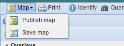

.. _data:

##############
Creating a map
##############

In C-READ GeoNode System maps are comprised of various layers and their styles. Layers can be both local layers in C-READ GeoNode as well as remote layers either served from other WMS servers or by web service layers such as Google or MapQuest. 
C-READ GeoNode maps also contain other information such as map zoom and extent, layer ordering, and style. 

1. Click the Maps link on the top toolbar. This will bring up the list of maps then click on Create a New Map.

.. image:: img/C-READ_ExploreMaps.png

2. A map composition interface will display. In this interface there is a toolbar, layer list, and map window. The map window contains the MapQuest OpenStreetMap layer by default. There are other service layers available here as well: Bing Aerial With Labels, MapQuest Imagery and OpenStreetMap.

.. image:: img/C-READ_CreateMaps.png

3. Click on the New Layers button and select Add Layers.

.. image:: img/C-READ_AddLayersMaps.png

4. Select layers by clicking and click add Layers to add it to the map. The layers will be added to the map. Click Done (right next to Add Layers at the bottom) to return to the main layers list. The style of added layer could be edited clicking on Layer Style icon.

5. Saving map: click on the Map button in the toolbar, and select Save Map. 

6. Enter a title and abstract for your map. 

7. Click Save. Notice that the link on the top right of the page changed to reflect the map’s name.

