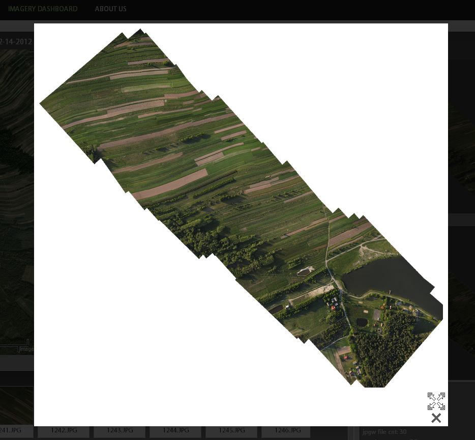
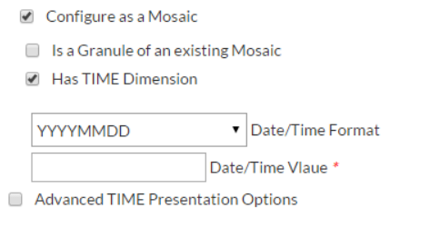

.. _geonode_create_mosaic:

###############
Create a mosaic
###############

An Introduction to Mosaics in GeoNode
=====================================

Tipically in GeoNode is possible to create a new Raster Layer composed by a single GeoTIFF.

A Mosaic in GeoNode is a particular type of Raster which contains a set of “Granules”,
i.e. a series of GeoTIFFs organized in “Dimensions” accessed through a unique Layer.
A Mosaic can have one or more Dimensions, depending on its structure. The kind and number
of Dimensions determine the way a Mosaic internally organize the set of Granules.
The Dimensions can be seen like indexes on a DataBase.

The simplest type of Mosaic has just one Dimension, which is the Spatial Dimension.
In that case when putting the Mosaic Layer into a Map, as an instance, all the Granules
are displayed as a single image composed by the Granules collection sptially distrubuted (see Figure 1)

   Figure 1

In GeoNode, when creating a new Mosaic, it is possible also to add a Temporal Dimension.
A Mosaic with the Temporal Dimension organizes the Granules not only in the space but
also along time by following particular rules and mechanisms that we will se later in
details. That means that in order to display a Granules on the map we must specify also
a date-time position or interval.

.. figure:: img/mosaic_figure2.png

   Figure 2

Figure 2 shows how the Mosaic changes along time. Basically by specifying the “TIME”
value as a parameter of the request, the Mosaic is able to retrieve and display the
correct Granule.

Create a new Mosaic with Time
=============================

In this section we will see step by step how it is possible to add a new Mosaic in GeoNode.
The procedure is usually simple, but there are few things to know especially on data preparation.

Prepare the Data for the first ingestion
----------------------------------------

Create a new Mosaic in GeoNode is very similar to the creation of a new standard Raster Layer.
In order to create the new Mosaic you will need the *first* granule, i.e. one GeoTIFF which
will be used to populate the very first granule and options of the Mosaic.

.. hint::
    The name of the Mosaic will be equal to the name of the first granule.
    Therefore before starting the ingestion, be sure that the first GeoTIFF
    has a good name which describes the content of the whole Mosaic and not
    only the single Granule.

.. important::
    Avoid any kind of date-time info as part of the first granule file name.

Assuming that we want to create a new Mosaic with the Temporal Dimension, what we need to do is:

1. Get a single GeoTIFF which will represent the first Mosaic Granule, and rename the file using a descriptive name for the whole Mosaic.
2. Note somewhere the date-time of the GeoTIFF above, this will be required during the Mosaic creation procedure

In the next example we will use some Python scripts to download a NetCDF file from
MyOcean - Copernicus1 Online Catalog, extract GeoTIFF granules for the “sea surface
temperature” and prepare the first granule for the new Mosaic.

1. Download the Python scripts from `<https://github.com/geosolutions-it/cread-mosaics.git>`_ ::

      git clone https://github.com/geosolutions-it/cread-mosaics.git

2. Use the ``motu-client.py`` (which is located into the ``motu-client/`` folder) and
   run the following command line from the shell ::

      python motu-client.py -u YOUR_USERNAME -p YOUR_PASSWORD   \ 
         -m http://data.ncof.co.uk/mis-gateway-servlet/Motu     \
         -s http://purl.org/myocean/ontology/service/database#SST_GLO_SST_L4_NRT_OBSERVATIONS_010_014    \
         -d METOFFICE-GLO-SST-L4-NRT-OBS-SKIN-DIU               \  
         -x -115.561581 -X -40.722711 -y -2.270676 -Y 36.750010 \
         -t "2015-08-10 00:30:00"                               \ 
         -T "2015-08-10 23:30:00"                               \ 
         -v sea_ice_fraction -v mask -v analysed_sst            \
         -o output -f METOFFICE-GLO-SST-L4-NRT-OBS-SKIN-DIU.nc

   .. note::
      You need a valid Copernuicus username and password in order to be able to execute
      the script above. You also need to provide a valid start time and end time accordingly to your needs.
    
   .. note::
      It is possible to download the dataset also via the Copernicus Web GUI instead of
      using the Python Script.

3. From the folder ``SST_GLO_SST_L4_NRT_OBSERVATIONS_010_014/`` run the following Python script ::

       python mosaic_METOFFICE-GLO-SST-L4-NRT-OBS-SKIN-DIU.py METOFFICE-GLO-SST-L4-NRT-OBS-SKIN-DIU.nc temperature

   .. note::
       You need to copy the ``METOFFICE-GLO-SST-L4-NRT-OBS-SKIN-DIU.nc`` locally first.

   If everything proceeds as expected at the end of the processing you should be able
   to see a list of GeoTIFFs like the one depicted in Figure 3

   .. figure:: img/mosaic_figure3.png

      Figure 3

4. Rename the first GeoTIFF and note somewhere its date-time position ::

     mv temperature_20150809T003000Z.tif METOFFICE-GLO-SST-L4-NRT-OBS-SKIN-DIU-sst.tif

Now the data is ready, lets now proceed with the Mosaic creation.

.. hint::
    Notice that that first Granule file name **does not** contain any date-time info
    but it is highly recommended to put in the name of the Variable (in the example sst).
    The name of the next Mosaic Granules must not be equal to the first one. It is highly
    recommended to leave here the date-time position instead.

Create the layer in GeoNode
---------------------------

1. Login as superuser into the GeoNode GUI and click on “Upload Data” as shown in Figure 4

   .. figure:: img/mosaic_figure4.png

      Figure 4

2. Click on "Upload Mosaics" as shown in Figure 5

   .. figure:: img/mosaic_figure5.png

      Figure 5

3. Select the ``METOFFICE-GLO-SST-L4-NRT-OBS-SKIN-DIU-sst.tif`` file from your local
   filesystem (see Figure 6)

   .. figure:: img/mosaic_figure6.png

      Figure 6

4. Check the "Configure as Mosaic" option, check the box "Has TIME Dimension" and choose
   the correct “Date/Time Format” as depicted in Figure 7

   .. figure:: img/mosaic_figure7.png

      Figure 7

   Put the date-time position saved before (20150809T003000Z) into the “Date/Time Value”,
   similar to the Figure 7.

5. We are ready to create the Mosaic; click on the “Upload Files” button and wait
   until finished. If everything goes as espected you should see something similar to the Figure 8

   .. figure:: img/mosaic_figure8.png

      Figure 8

6. Click on “Next: Edit Metadata” and select the Category “Ocean Monitoring - Sea temperature”
   from the “Geographical and BioPhysical Environment” list as shown in Figure 9

   .. figure:: img/mosaic_figure9.png
   
        Figure 9

   You can optionally update the Abstract and Title if you need.
   
7.  Update the Metadata and edit the new Mosaic Layer details (Figure 10)

   .. figure:: img/mosaic_figure10.png

      Figure 10

   Notice that a Mosaic Layer has a few differences from a typical GeoNode Layer:

   a. If the Mosaic has a Temporal Dimension the map preview has a time-slider control (see Figure 11)

      .. figure:: img/mosaic_figure11.png

        Figure 11

   b. The south panel shows another tab named "Granules"; clicking on it, is possible to
      show the list of the available Mosaic Granules and preview them on the map (see Figure 12)

      .. figure:: img/mosaic_figure12.png

         Figure 12

   c. The "Attributes" tab panel also presents few more options; as shown in Figure 13
      among the Layer Attributes are present also the Mosaic Dimensions.

      .. figure:: img/mosaic_figure13.png

         Figure 13

      Notice that the Dimensions have two columns, ``Enabled`` and ``Regex``. The first one
      is obvious, while the regex one will be explained in details on the next sections.

The "Temporal Dimension" Options and the file formats
-----------------------------------------------------

When configuring the Temporal Dimension of a Mosaic there are few options available
which may be selected by the user

1. Date/Time Format and Value
'''''''''''''''''''''''''''''

As shown in Figure 14, the first mandatory option to choose is the Date/Time Format and Value

        Figure 14

Currently it is possible to select among three possible options:

    a. ``YYYYMMDD``
    
       year (4 digits), month (2 digits) and day (2 digits).  
       
       E.g.: ``20150810``

    b. ``YYYYMMDD'T'hhmmss``
    
       year (4 digits), month (2 digits), day (2 digits), "``T``", hours (2 digits), minutes (2 digits) and seconds (2 digits).
       
       E.g. ``20150810T130000``

    c. ``YYYYMMDD'T'hhmmss'Z'``
    
       year (4 digits), month (2 digits), day (2 digits), "``T``", hours (2 digits), minutes (2 digits), seconds (2 digits) and "``Z``"

       E.g. ``20150810T130000Z``

It is mandatory to select the Date/Time Format and Value for each Mosaic. In particular the Value represents the date-time position of the first Granule.

Under the hood the system looks for Granules compatible with the Mosaic into the filesystem accordingly to the regular expression associated to every Date/Time format:

    a. ``YYYYMMDD: regex=(?<=_)([0-9]{8})``
    
       The Mosaic will look for files having in the name a date-time value like the following one ::
       
           mygranulefilename_20150810.tif

    b. ``YYYYMMDD`T`hhmmss: regex=(?<=_)([0-9]{8}T[0-9]{6})``

       The Mosaic will look for files having in the name a date-time value like the following one ::
       
           mygranulefilename_20150810T130000.tif

    c. ``YYYYMMDD`T`hhmmss`Z`: regex=(?<=_)([0-9]{8}T[0-9]{6}Z)``
    
       The Mosaic will look for files having in the name a date-time value like the following one ::

           mygranulefilename_20150810T130000Z.tif

Only the files matching the regular expressions will be acceptable for a certain Mosaic.
Therefore it is very important to select the correct Date/Time Format and Value during the creation of a new Mosaic.

2. Advanced TIME Presentation Options
'''''''''''''''''''''''''''''''''''''

The Figure 15 shows other optional advanced options for the Temporal Dimension.

.. figure:: img/mosaic_figure15.png

    Figure 15

Those options affect the presentation of the time instants on the GeoServer GetCapabilities.
This is something that a user probably will never see, but it is important to maintain the
GetCapabilites as small as possible in order to be efficiently parsed by GeoNode or other OGC clients.

Presentation
------------

    a. **List**: GeoServer will print the comma separated list of the time positions of every
       single Granule of the Mosaic into the GetCapabilities document (see Figure 16)

       .. figure:: img/mosaic_figure16.png

          Figure 16

       As you may notice the list could be quite long, especially if the Mosaic contains a lot of Granules. This is also the Default GeoServer presentation option, but also the more risky one.

    b. **Interval and Resolution**: if the Granules are equally distributed in time (as an instance one Granule each hour), it is possible to let GeoServer list the values in a compact way.

       Choosing 1 Hour as shown in the Figure 17

       .. figure:: img/mosaic_figure17.png

          Figure 17

       The outcome is quite different (see Figure 18)

       .. figure:: img/mosaic_figure18.png

          Figure 18

       The time dimension now shows just the start time, end time and the resolution interval (``PT1H``).

    c. **Continuous Interval**: this last option is the more generic. The outcome is similar
       to the "Interval and Resolution" one, but there is no resolution interval, since we
       are assuming a continous distribution of the values along the range.

Default Value
-------------

This option instruct GeoServer on how to serve the Mosaic if no value for the Dimension
have been specified. In other words, this is the default strategy to select a valid
Granule if the user or client does not specify any value for one or more Mosaic Dimensions.

The possible options are:

a. **Use built-in method to select the value**: 
   GeoServer will use the default strategy for the Dimension.
   As an instance for the Time Dimension it will select the most recent Granule available.

b. **Use the smallest domain value**: For the Time Dimension, GeoServer will choose the oldest Granule.

c. **Use the biggest domain value**: For the Time Dimension, GeoServer will choose the youngest Granule.

d. **Use the domain value nearest to the reference value**: It is mandatory to specify a reference
   value which will be used by GeoServer to select the Granule. In that case it will get the Granule
   nearest to the reference value.
   
   For the Time Dimension the reference value must be a valid ISO-8601 Date/Time Format
   
   e.g.: ``YYYY-MM-DDThh:mm:ss+00:02``

e. **Use the reference value**: It is mandatory to specify a reference value which will be used
   by GeoServer to select the Granule. In that case it will get the Granule equal to the reference value.
   For the Time Dimension the reference value must be a valid ISO-8601 Date/Time Format
   
   e.g.: ``YYYY-MM-DDThh:mm:ss+00:02``

Populate an existing Mosaic
---------------------------

There are two ways to add Granules to an existing Mosaic in GeoNode:

1. Through the GeoNode GUI, it is possible to upload a new GeoTIFF as part of a Mosaic.

2. Using some automatic Python scripts which will extract data from a NetCDF and
   automatically ingest the Granules into an existing Mosaic.

Insert manually a new Granule into an existing Mosaic
-----------------------------------------------------

The procedure is similar to the creation of a new Mosaic, except that most of the
options will be automatically set by GeoNode and it will be mandatory to insert the
requested values.

1. From "Upload Data" click on "Upload Mosaic" button. From the "Upload" page, select
   the GeoTIFF to upload and check the option "Configure as a Mosaic".
   As shown in Figure 19, select the option "Is a Granule of an existing Mosaic" and
   then select from the dorpdown combo the name of the Mosaic Layer you want to populate.

   .. figure:: img/mosaic_figure19.png
  
      Figure 19

2. The Temporal Dimension options will be automatically selected and cannot be changed
   by the user. In order to proceed insert the mandatory values and "Upload Files".

3. Once the process has finished, verify on the Layer Details that the new Granule has
   been correctly added to the Mosaic (see Figure 20)

   .. figure:: img/mosaic_figure20.png
   
      Figure 20

In the "Data" section of this guide you will see how to automate the ingestion of
Granules into an existing Mosaic

