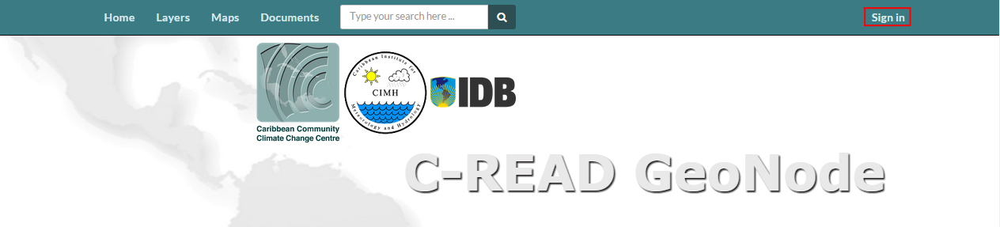
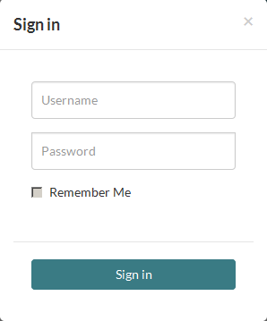

.. _data:

#################
User registration
#################

In C-READ GeoNode welcome page you can view and modify existing spatial layers and maps, as well as find information on other GeoNode users. But, without being logged in, you are limited to read-only access of public layers. In order to create a map and add layers to it, you have to have create an account first.

1. From any page in the web interface, you will see a Sign in link. Click that link, and in the dialog that displays, click the Register now link.

2. On the next page, fill out the form. Enter a user name and password in the fields. Also, enter your email address for verification.

3. You will be returned to the welcome page. An email will be sent confirming that you have signed up. While you are now logged in, you will need to confirm your account. Navigate to the link that was sent in the email.

4. By clicking Confirm you will be returned to the homepage. Now you’ve registered an account, you are able to add layers to it as well as create maps and share those with other users.
