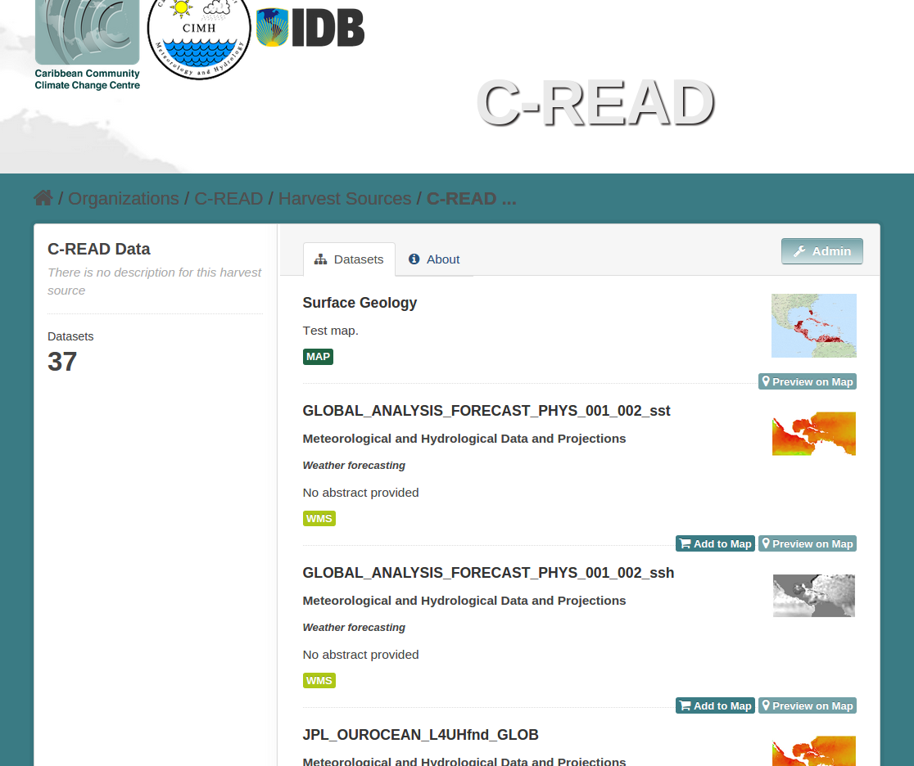
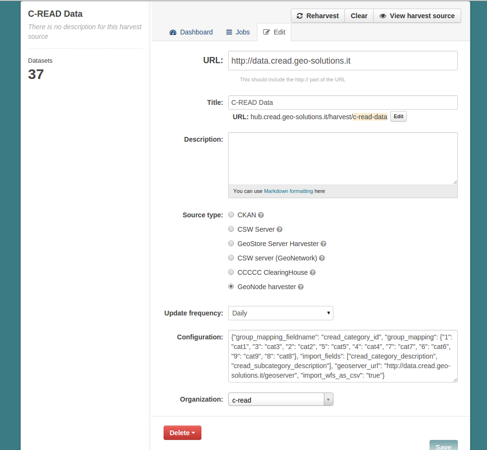
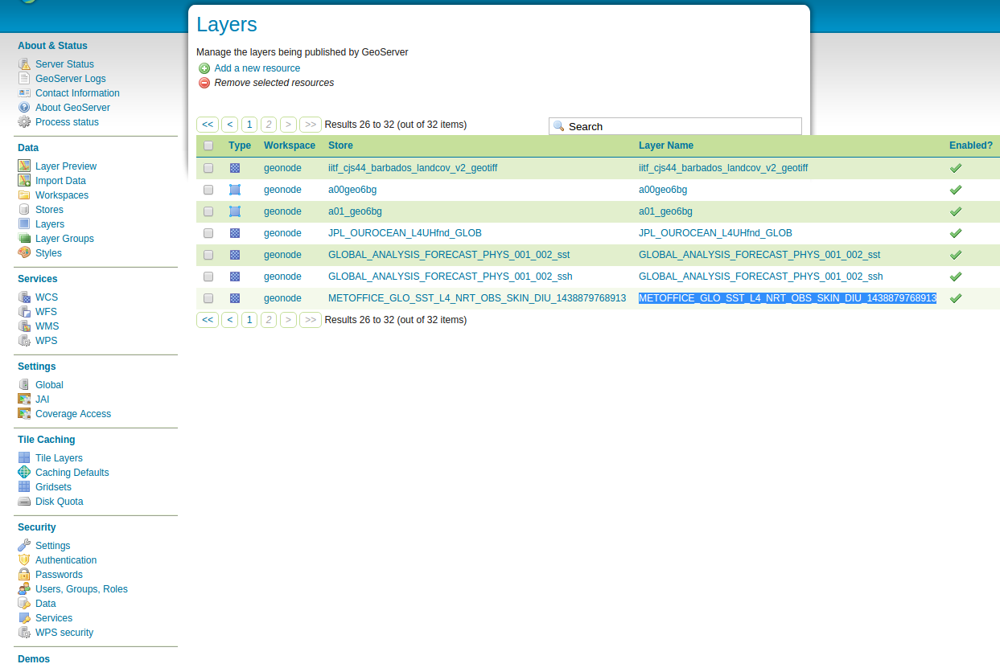
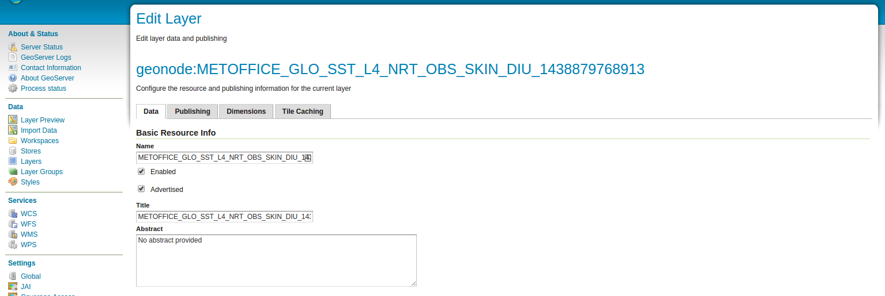

Troubleshooting
===============

This section of the documentation provides information about common problems you
may encounter using the C-READ Hub.

How can I harvest new data?
---------------------------

The C-READ Hub can be configured to re-harvest its the data on a regular basis,
for example every day if you prefer to do it manually you can always force a re-harvest
of the data through the UI.

Schedule automatic re-harvest of the data
'''''''''''''''''''''''''''''''''''''''''

Login as administrator and navigate to the dataset of interest ( in this example
the `c-read-data` dataset )

Click on the `Admin` button. In the `Dashboard` tab you will see a summary of the
last harvesting job run. Under the `Jobs` tab there is a complete list of all the
previous jobs run.

Click on the `Edit` tab and configure the job

Save the configuration.

Manual re-harvest of the data
'''''''''''''''''''''''''''''

Login as administrator and navigate to the dataset of interest ( in this example
the `c-read-data` dataset )

Click on the `Admin` button. In the `Dashboard` tab you will see a summary of the
last harvesting job run.

In the top right corner of the panel there is a `Reharvest` button. Click on the
button to manually schedule a new harvest of the data. A new harvest will run within
the next 15 minutes. You can follow the progress of the job in the `dashboard`

.. image::

New layer does not show up in the Hub
-------------------------------------

For the C-READ Hub to be able to harvest the data from GeoNode the layer needs to
be marked as `advertised` this should be automatically when you create the new layer
on GeoNode otherwise you can do it manually:

- Navigate to `http://data.cread.geo-solutions.it/geoserver` and login ad administrator
- Click on `Layers` in the panel on the left, then click on the layer you want to
edit (in this example `METOFFICE_GLO_SST_L4_NRT_OBS_SKIN_DIU_1438879768913`)

- Make sure the `Advertised` checkbox is checked

- Save the configuration and logout

- Now navigate to the `C-READ Hub <http://data.cread.geo-solutions.it>`_ , login as administrator and schedule a re-harvest of the dataset as explained above.

After the harvest if terminated you should be able to see the new data in the Hub
