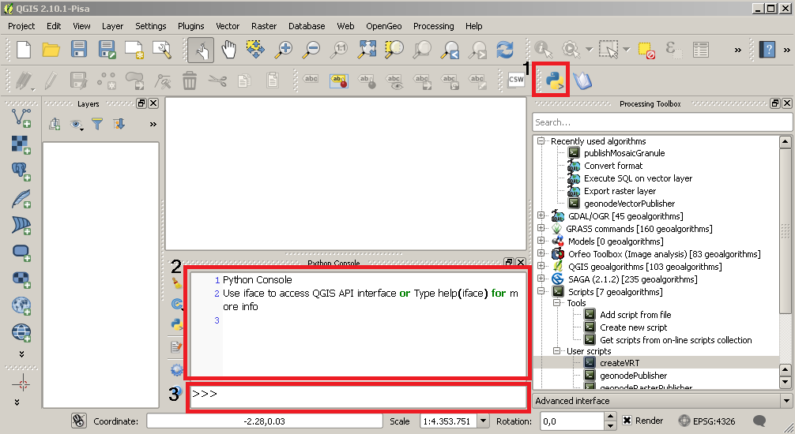

################################
Workflows Use Cases overview
################################

These chapters describe the example workflows developed for this training. 

The workflows address some of the most common use cases that deal with geospatial dataset: 

- **Vector data filtering** filters the features of a vector layer, creating a subset of its data, before its publication.
- **Raster optimization** improves *zoom* and *pan* actions performances once the raster is loaded on geonode.
- **Data dissemination** loads the data (raster or vector) on geonode.

QGIS setup
--------

To run the C-READ workflows, some QGIS configurations are required:

#. Install the Processing Workflows plugin, see :ref:`installing-workflow-plugin`
#. Install the **request** python library, see the :ref:`python-requests` paragraph below
#. Import the custom processing scripts, see the :ref:`python-custom-scripts` paragraph below
#. Configure the workflows plugin directory, see :ref:`installing-a-workflow`

The paragraphs linked above can be skipped if a training QGIS instance has been already provided.

A very useful tool is the **embedded python console**.

It is useful for:

- Low-level monitoring of the Workflows execution 
- Test new custom scripts

#. The console can be activated clicking on the button on top (the pyton logo)
#. Follow up the execution logs of the python scripts which compose the workflows
#. Test the python commands

.. _python-requests:

Python dependency installation: the request library
====================================================

In order to publish the QGIS processed data on geonode the publishing scripts developed requires a library called **requests** that is one of most used python library to perform HTTP requests.
The **pyQGIS** environment provides a less advanced library called httplib2 which doesn't support the multipart Content-type.

Linux Installation
*******

Since the QGIS linux version uses the system default python installation it's enough to install request through **pip**::

	sudo pip install request
	
Windows Installation
********

The QGIS windows version uses an embedded python installation so requests can be installed copying its files in the site-package dir.
These instructions have been tested on `QGIS - 2.10.1-Pisa` running on Windows7

- Locate the QGIS installation folder, let's call it ``QGIS_HOME`` (f.e. ``C:\Program Files\QGIS Pisa``)
- Download the library as a zip archive from `the official requests website <https://github.com/kennethreitz/requests/zipball/master>`_
- Extract the content and copy the ``requests`` folder in ``QGIS_HOME\apps\Python27\Lib\site-packages``
- Open the QGIS, then its python console and type: ``import requests``. If no error are shown the library has been successfuly installed.

.. _python-custom-scripts:

Python dependencies installation: the custom scripts
========================================================

From the Processing Workflow panel choose **Scripts** > **Add script from file** and then choose the script to import.

	 
The required scripts are:

- createVRT.py
- geonodeRasterPublisher.py
- geonodeVectorPublisher.py
- publishMosaicGranule.py

Vector process and publishing workflow
--------

This workflow uses a mix of QGIS build-in processing algorithms (**Step2** and **Step3**) and custom scripts implemented ad-hoc for the interaction with the C-READ platform (**Step1** and **Step4**)

.. figure:: img/QGIS_Vector_workflow.png
     :width: 350px
*A blocks diagram of the vector workflow which identifies the 4 steps*

Open the QGIS instance and go to the :ref:`vector-workflows` page to start the tutorial.

Raster process and publishing workflows
--------

This workflow uses a mix of QGIS build-in processing algorithms (**Step1** and **Step2**) and custom scripts implemented ad-hoc for the interaction with the C-READ platform (**Step3**)

Open the QGIS instance and go to the :ref:`raster-workflows` page to start the tutorial

.. figure:: img/QGIS_Raster_workflow.png
     :width: 350px 
*A blocks diagram of the raster workflows which identifies the 3 steps. The final step, the publication, could be performed as update of an Imagemosaic datastore (Geoserver) or as a standalone layer (Geonode)*