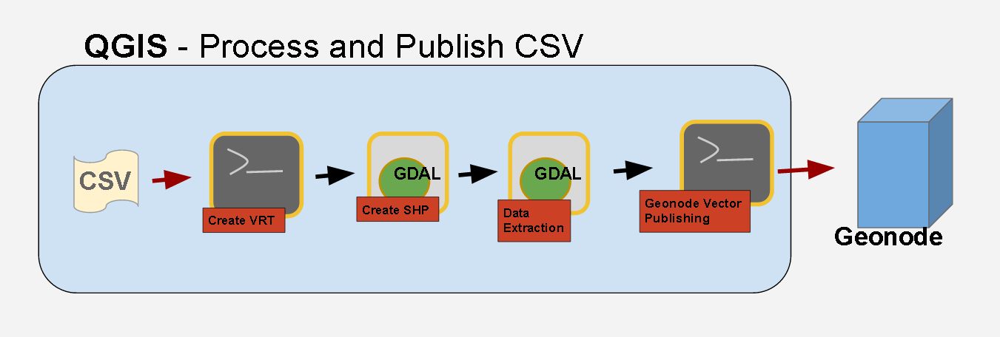
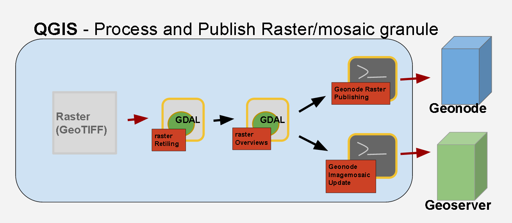

.. _QGIS:

########
Workflows Use Cases introduction
########

In these chapters there are some example workflows developed specifically for this training. 

They address some of the most common use cases: **raster processing** and **data dissemination** through geonode.

Geospatial processing steps performed in these workflows are the optimization of Raster dataset and the Vector datasource features filtering and extraction.

Vector process and publishing workflow
--------

Read the `Vector process and publishing workflow`_ chapter

*A blocks diagram of the vector workflow which identifies the 4 steps*

Raster process and publishing workflows
--------
Read the `Raster process and publishing workflows`_ chapter

*A blocks diagram of the raster workflows which identifies the 3 steps. The final step, the publication, could be performed as update of an Imagemosaic datastore (Geoserver) or as a standalone layer (Geonode)*