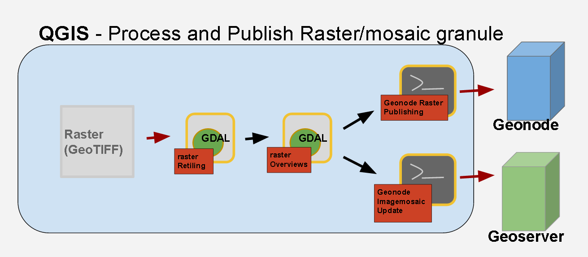

.. _QGIS:

########
Vector process and publishing workflow
########

Overview
---------

Geospatial vector data exported from third-party systems are often in CSV format.

CSV format is not directly supported in many GIS software so often the CSV datasource is converted into a ESRI Shapefile (See **step1/4** and **step2/4**)

Once the shapefile is created a data extraction using a SQL query is performed (see **Step3/4**)

The layer will be published in the last workflow step on a Geonode istance (see Step4/4)

.. image:: img/QGIS_Vector_workflow.png

Step 1/4 - Create a VRT file from the CSV datasource
---------

In order to be able to do convert a CSV in a Shapefile an intermediate format called  VRT (ViRtual Format) file must be created first.
See the `official GDAL documentation <http://www.gdal.org/gdal_vrttut.html>`_ for more information about VRT and how to create a VRT for a CSV datasource. 

**Main parameters:**

- **Layer name** the name of the csv file without the extension ".csv"
- **src Datasource** the input CSV file

.. note:: Layer name must be the same of the src Datasource filename

Step 2/4 - Convert the CSV in a Shapefile
---------

This step translate a CSV datasource in a shapefile using the VRT file previously created and import it as a layer into QGIS.

The conversion will be then performed using the `ogr2ogr command <http://www.gdal.org/ogr2ogr.html>`_ from the GDAL's OGR utilities.

**Main parameters:**

- **Input Vector** the VRT created in the previous step using the input CSV

Step 3/4 - Extract data using sql
---------

From the dataset created in the previous step can we can extract a subset of features.

The sql query as the second parameter in this form will be performed on the layer selected in the above dropdown list, no matter if the layer is stored on a non DBMS datasource.

**Main parameters:**

- Substitute *[attribute]* with the name of the feature attribute you want to filter on and *[value]* with the value of that attribute.

.. warning:: DON'T delete the quotes ( **'** ) around the *[attribute]* when you replace the value!

You can also improve that query performing a more complex filtering but be aware of:

.. warning:: The **select * from OUTPUTLAYER** part shouldn't be changed. You can change only the where clausule.

Step 4/4 - Geonode vector publishing as a single layer
---------

Publish the Shapefile layer created on a Geonode instance

**Main Parameters**:

- **Geonode URL** the base URL of the Geonode instance.
	examples:
		``http://192.168.50.170:8000`` or ``http://awebsite.geonode.org``
- **User** a username who has the publications grants required
- **Password** the user password
- **Vector Layer** the previously created layer opened in the current project
- **Title** a geonode metyadata
- **Abstact** A geonode metyadata

========
Raster process and publishing workflows
========

Overview
---------

Any raster published on a geospatial server must be optimized in order to be efficently served to the clients

This workflow compute the raster retiling and creates its overviews using GDAL-Translate for the former and GDAL-addo for the latter action (Steps 1, 2)

The optimized layer will be at the end (Step 3) published on Geonode as a single-image Raster Layer

Step 1/3 - Retile with GDAL translate
---------

Uses GDAL-Translate to perform retiling and improve pan actions on the layer once published

See the `GDAL documentation <http://www.gdal.org/gdal_translate.html>`_  for more info about GDAL translate

**Main Parameters:**

- **Input Vector** Select on the file system the raster to process

Step 2/3 - Add overviews with GDAL addo
---------

Uses GDAL-Addo to create overviews to improve zoom actions of the layer

See the `GDAL documentation <http://www.gdal.org/gdal_translate.html>`_ for more info about GDAL addo

**Main parameters:**

- **Input Vector** Select on the file system the raster to process

Step 3a/3 - Geonode raster publishing as a single layer
---------

Publish the Raster layer created on a Geonode instance

**Main parameters:**

- **Geonode URL** the base URL of the Geonode instance.
	examples:
		``http://192.168.50.170:8000`` or ``http://awebsite.geonode.org``
- **User** a username who has the publications grants required
- **Password** the user password
- **Raster Layer** the previously created layer opened in the current project
- **Title** a geonode metadata
- **Abstact** a geonode metadata

Step 3b/3 - Geonode raster publishing as a imagemosaic  update
---------

Update an Image mosaic with the raster layer created.

The raster will be directly published on  Geoserver , adding a one more time instance to an Imagemosaic datastore

**Main parameters:**

- **Geoserver URL** the base URL of the Geonode instance.
	examples:
		``http://192.168.50.170:8080/geosever`` or ``http://awebsite.geonode.org/geoserver``

- **Image mosaic Store Name** the name of the datastore published on Geoserver
- **Image mosaic Granule to add** the previously created layer opened in the current project
