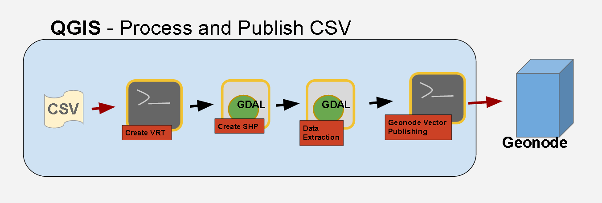
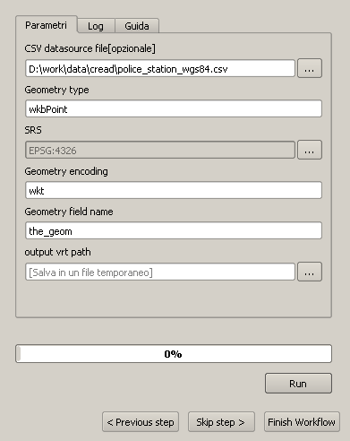
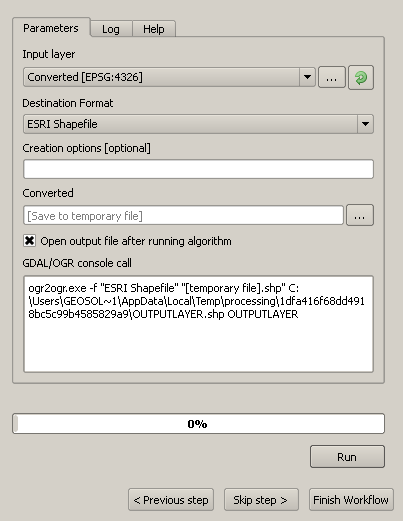
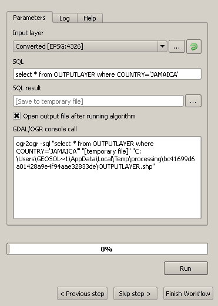
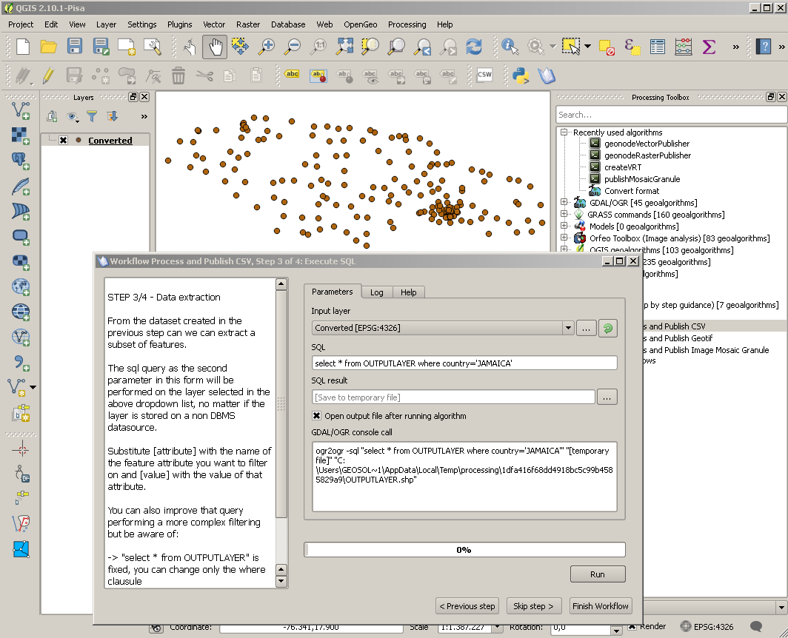
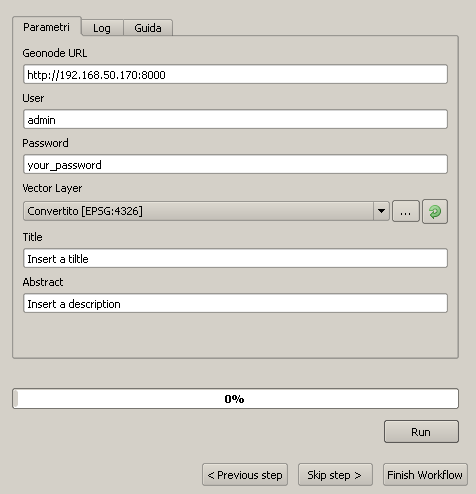
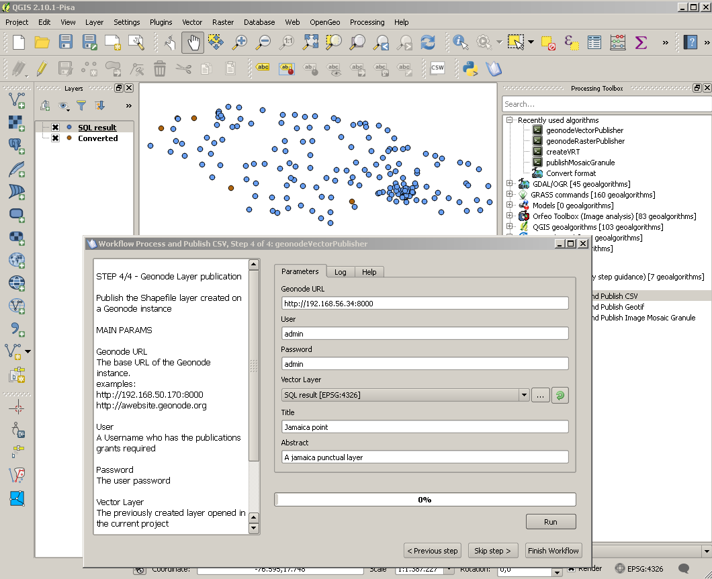
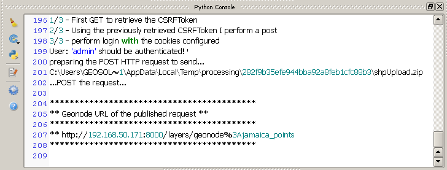
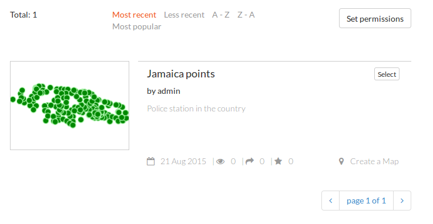

.. _vector-workflows:

######################################
Vector process and publishing workflow
######################################

Overview
--------

Geospatial vector data exported from third-party systems are often in CSV format.

CSV format is not directly supported in many GIS software so often the CSV datasource is converted into a ESRI Shapefile (See **step1/4** and **step2/4**)

Once the shapefile is created a data extraction using a SQL query is performed (see **Step3/4**)

The layer will be published in the last workflow step on a Geonode istance (see Step4/4)

Step 1/4 - Create a VRT file from the CSV datasource
----------------------------------------------------

In order to be able to do convert a CSV in a Shapefile an intermediate format called  VRT (ViRtual Format) file must be created first.
See the `official GDAL documentation <http://www.gdal.org/gdal_vrttut.html>`_ for more information about VRT and how to create a VRT for a CSV datasource. 

**Main parameters:**

- **src Datasource file** the input CSV file absolute path (use the browse button to select it)

Step 2/4 - Convert the CSV in a Shapefile
-----------------------------------------

This step translate a CSV datasource in a shapefile using the VRT file previously created and import it as a layer into QGIS.

The conversion will be then performed using the `ogr2ogr command <http://www.gdal.org/ogr2ogr.html>`_ from the GDAL's OGR utilities.

**Main parameters:**

- **Input Vector** the VRT created in the previous step using the input CSV

Step 3/4 - Extract data using sql
---------------------------------

From the dataset created in the previous step can we can extract a subset of features.

The sql query as the second parameter in this form will be performed on the layer selected in the above dropdown list, no matter if the layer is stored on a non DBMS datasource.

**Main parameters:**

- Substitute *[attribute]* with the name of the feature attribute you want to filter on and *[value]* with the value of that attribute.

.. warning:: DON'T delete the quotes ( **'** ) around the *[attribute]* when you replace the value!

You can also improve that query performing a more complex filtering but be aware of:

.. warning:: The **select * from OUTPUTLAYER** part shouldn't be changed. You can change only the where clausule.

Step 4/4 - Geonode vector publishing as a single layer
------------------------------------------------------

Publish the Shapefile layer created on a Geonode instance

**Main Parameters**:

- **Geonode URL** the base URL of the Geonode instance (No backslash at the end of teh URL!!)
	examples:
		``http://192.168.50.170:8000`` or ``http://awebsite.geonode.org``
- **User** a username who has the publications grants required
- **Password** the user password
- **Vector Layer** the previously created layer opened in the current project
- **Title** a geonode metyadata
- **Abstact** A geonode metyadata

After the publication you can copy the URL of the resource from the QGIS python console

and see the published resource on the Geonode instance

