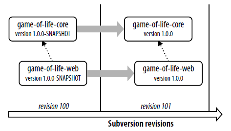

.. _create-job:

###############
Setting up jobs
###############

============
Introduction
============

A build job is a particular way of compiling, testing, packaging, deploying or otherwise doing something
with your project. Build jobs come in a variety of forms; you may want to compile and unit test your
application, report on code quality metrics related to the source code, generate documentation, bundle
up an application for a release, deploy it to production, run an automated smoke test, or do any number
of other similar tasks.

=============
Types of jobs
=============

Creating a new build job in Jenkins is simple: just click on the “New Job” menu item on the Jenkins
dashboard. Jenkins supports several different types of build jobs, which are presented to you when you
choose to create a new job, Jenkins supports four main types of build jobs as in the figure below.

.. image:: img/jobs.png

- **Freestyle software project**: Freestyle build jobs are general-purpose build jobs, which provides a maximum of flexibility.
- **Maven project**: The “maven2/3 project” is a build job specially adapted to Maven projects. Jenkins understands Maven pom files and project structures, and can use the information gleaned from the pom file to reduce the work you need to do to set up your project.
- **Monitor an external job**: The “Monitor an external job” build job lets you keep an eye on non-interactive processes, such as cron jobs.
- **Multiconfiguration job**: The “multiconfiguration project” (also referred to as a “matrix project”) lets you run the same build job in many different configurations. This powerful feature can be useful for testing an application in many different environments, with different databases, or even on different build machines. We will be looking at how to configure multiconfiguration build jobs later on in the book.
In this manual will be explained the **Freestyle software project** tipe.

==============================
Creating a Freestyle Build Job
==============================

The freestyle build job is the most flexible and configurable option, and can be used for any type of
project. It is relatively straightforward to set up, and many of the options we configure here also appear
in other build jobs.

General Options
---------------

The first section you see when you create a new freestyle job contains general information about the
project, such as a unique name and description, and other information about how and where the build
job should be executed.

.. figure:: img/create_build_job.png
   
	    Keeping a build job forever

The project name can be anything you like, but it is worth noting that it will be used for the project
directory and the build job URL, so I generally avoid names with spaces. The project description will go
on the project home page—use this to provide an overview of the build job’s goals and context. HTML
tags will work fine in this field.
The other options are more technical, and we will be looking at some of them in detail later on in the
book.
One important aspect that you should think about upfront is how you want to handle build history. Build
jobs can consume a lot of disk space, especially if you store the build artifacts (the binary files, such
as JARs, WARs, TARs, etc., generated by your build job). Even without artifacts, keeping a record
of every build job consumes additional disk space and memory, which may or may not be justified,
depending on the nature of your build job. For example, for a code quality metrics build that reports on
static analysis and code coverage metrics over time, you might want to keep a record of the builds for
the duration of the project, whereas, for a build job that automatically deploys an application to a test
server, keeping the build history and artifacts for posterity might be less important.
The Discard Old Builds option lets you limit the number of builds you record in the build history. You
can either tell Jenkins to only keep recent builds (Jenkins will delete builds after a certain number of
days), or to keep no more than a specified number of builds. If a certain build has particular sentimental
value, you can always tell Jenkins to keep it forever by using the Keep forever button on the build details
page (see Figure, “Keeping a build job forever”). Note that this button will only appear if you have
asked Jenkins to discard old builds.

Advanced Project Options
------------------------

The Advanced Project options contains, as the name suggests, configuration options that are less
frequently required. You need to click on the Advanced button for them to appear (see Figure 5.4, “To
display the Advanced Options, you need to click on the Advanced button”).
.. figure:: img/Advanced_Options.png

	    To display the Advanced Options, you need to click on the Advanced button

The Quiet Period option in the build job configuration simply lets you override the system-wide
quiet period defined in the Jenkins System Configuration screen. This option is mainly used for version control systems that don’t support atomic
commits, such as CVS, but it is also sometimes used in teams where developers have the habit of
committing their work in several small commits.
The “Block build when upstream project is building” option is useful when several related projects are
affected by a single commit, but they must be built in a specific order. If you activate this option, Jenkins
will wait until any upstream build jobs (see  “Build Triggers”) have finished before starting
this build.
For instance, when you release a new version of a multimodule Maven project, version number updates
will happen in many, if not all, of the project modules. Suppose, for example, that we have added a web
application to the Game of Life project we used in Chapter 2, Your First Steps with Jenkins, setting it up
as a separate Maven project. When we release a new version of this project, both the core and the web
application version numbers will be updated (see Figure 5.5, “The “Block build when upstream project
is building” option is useful when a single commit can affect several related projects”). Before we can
build the web application, we need to build a new version of the original Game of Life core module.
However if you had a separate freestyle build job for each module, then the build jobs for both the core
and the web application would start simultaneously. The web application build job will fail if the core
build job hasn’t produced a new version of the core module for it, even if there are no test failures.
To avoid this issue, you could set up the web application build job to only start once the core build
has successfully terminated. However this would mean that the web application would never be built if
changes were made that only affected it, and not the core module. A better approach is to use the “Block
build when upstream project” option. In this case, when the version numbers are updated in version
control, Jenkins will schedule both builds to be executed. However it will wait until the core build has
finished before starting the web application build.

	    The “Block build when upstream project is building” option is useful when a single commit can affect several related projects

You can also override the default workspace used by Jenkins to check out the source code and build
your project. Normally, Jenkins will create a special workspace directory for your project, which can be
found in the project’s build job directory (see Section 3.13, “What’s in the Jenkins Home Directory”).
This works fine in almost all cases. However, there are times when you need to override this option,
and force Jenkins to use a special directory. One common example of this is if you want several build
jobs to all work successively in the same directory. You can override the default directory by ticking
the “Use custom workspace” option, and providing the path yourself. The path can be either absolute,
or relative to Jenkins’s home directory.
