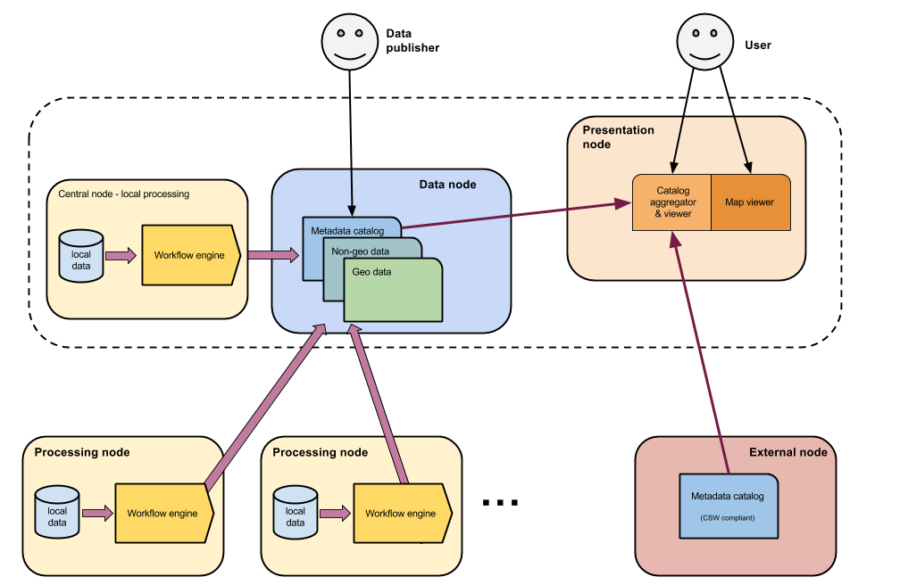

.. _cread-main-architecture:

#####################
Architecture overview
#####################

The C-READ system is built upon several blocks which offer different functionalities to the system.

The complete architecture envisages a **presentation node**, or **hub**, that is the front-end for the final external users. 
It provides both a search interface for searching into the catalog, and a map viewer which will display the desired geographic data.
 
The **data node** is the main node which contains all the data added to the system. 
It provides entrypoint both for users, where new data can be added, and for external processes that can send info to the system.  

**Processing nodes** are external nodes that can process data. Human attended and unattended nodes are possible, and 
are implemented with different softwares.    

The whole system will also take advantage of other **external nodes** providing info. These info will be
harvested into the presentation node. 

