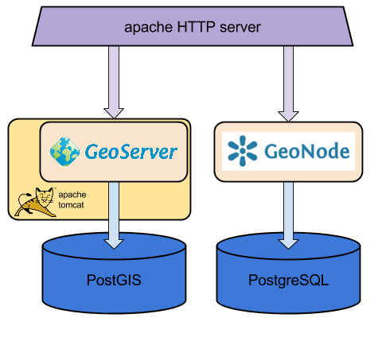

.. _geonode-components-overview:

===========================
GeoNode Components Overview
===========================

Base GeoNode overview
---------------------

Here a diagram of the main components needed for running a GeoNode instance.

Here a quick description of each component:

GeoNode
  Is the main GeoNode component.

GeoServer
  Is the main GeoServer component.
  
Apache HTTP server
  Proxies the external HTTP requests toward GeoNode and GeoServer.
  Apache httpd is often used as frontend to the outside world in order to decouple internal application communications.  
  
PostgreSQL
  A relational DBMS used by GeoNode to store its data.
  
PostGIS
  A PostgreSQL DBMS extended with geographic functionalities. 
  used by GeoServer to store geographic data.
  
Apache Tomcat
  The servlet container used to run GeoServer.
     

C-READ GeoNode architecture
---------------------------

In the C-READ architecture, we need to update some specific components, because 
some development has been done on GeoServer, GeoNode and related libraries that have not 
been merged into the official repositories yet.

   
C-READ app
   Contains the implementation of the CREAD custom features and the graphic layout.
   
gs-config
   Python libraries to send configuration commands to GeoServer.
   
gs-importer
   Python libraries to send data to the GeoServer importer.
   