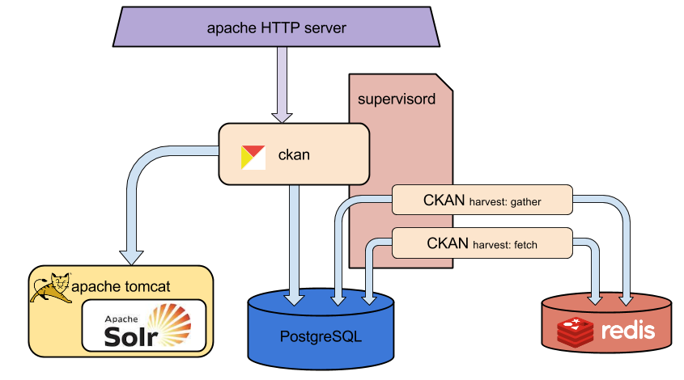
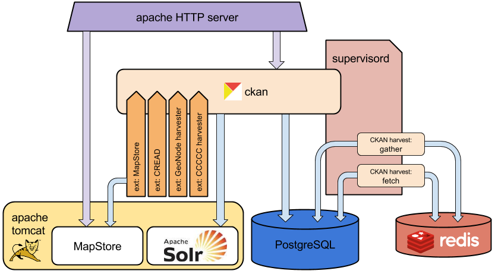

.. _hub-components-overview:

========================
CKAN Components Overview
========================

Base CKAN overview
------------------

Here a diagram of the main components needed for running a CKAN instance.

Here a quick description of each component:

CKAN
  Is the main CKAN component.
  
Apache HTTP server
  Proxies the external HTTP requests toward CKAN.
  Apache httpd is often used as frontend to the outside world in order to decouple internal application communications.  
  
PostgreSQL
  A relational DBMS used by CKAN to store its data.  

Apache Solr
  A document indexer. Used by CKAN to perform textual queries on the catalog entries.
  
Apache Tomcat
  The servlet container used to run Solr.
  
CKAN harvest
  CKAN runs a couple of external procedures for the harvesting flow. The execution of these procedures should be configured
  on its own.
  
supervisord
  A deamon for starting and monitoring programs executions. 
  
redis 
  Simple data storage server, used to handle the queues that control the harvesting stages.
   

C-READ CKAN architecture
------------------------

In the C-READ architecture, we need some more components:

   
We mainly need the layout customization, some extensions for harvesting, and the component for map visualization:

MapStore
   The web application for browsing maps
   
MapStore extension
   The CKAN extension to use MapStore for geographic preview and as client for map resources.
   
CREAD extension
   Extension for layout and styles customization
   
GeoNode harvester
   Harvester for GeoNode

CCCCC harvester
   Harvester for the CCCCC ClearingHouse
   
      