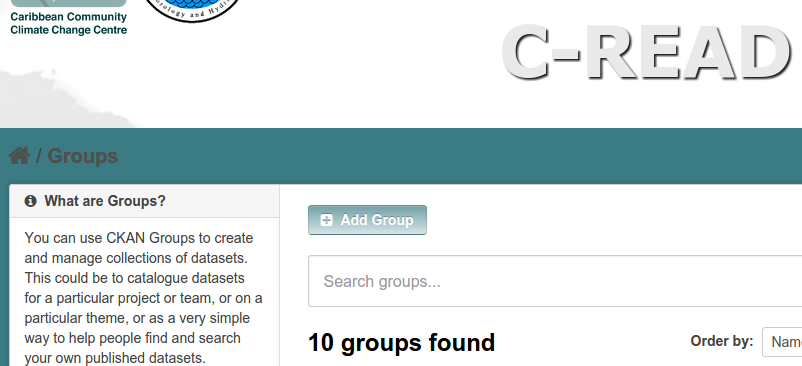
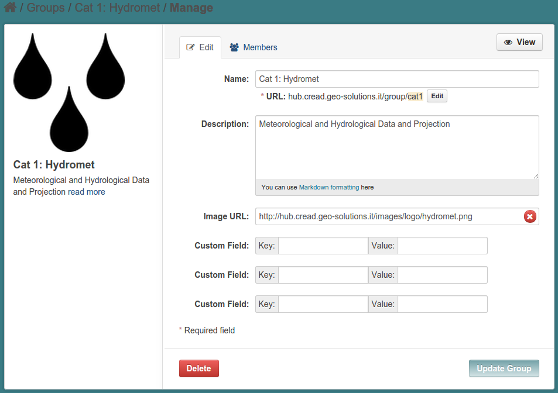

.. _ckan_setup_categories:

############
CKAN: Groups
############

Introduction
============

CKAN allows the handling of groups. Groups are simply a way of categorizing dataset inside CKAN.

In C-READ all the datasets are requested to be assigned one of the 10 C-READ categories.
All the data that will be harvested into CKAN will (possibily) have one category assigned.

Generally, in CKAN, a dataset may belong to more than one groups. Anyway, in the C-READ context,
we'll have a single group association to a dataset. 

Creating groups
===============

The final CKAN layout does not have any explicit link to the `Groups` page, but you can get in there    
using this link

   http://hub.cread.geo-solutions.it/group
   
You will see the list of the configured groups.   
If you have logged in with admin credentials, you will see the `add` button:
   

   

There have been created one CKAN group for each one of the C-READ categories.

Here is the first one:
    

      
When creating a group, you have to set:

- a mandatory **name**
- an optional **code** that will be used to address the group in the URLs. 
  If the URL is not edited, it will default to an encoded form of the name.
- an optional **description**
- an optional **image** (optional)

The "official" name for the C-READ categories can be quite long (category 1 is 
"`Meteorological and Hydrological Data and Projection`"), but this name occurs in many places inside CKAN, so we had to 
shorten them to something different.
We then put the official name in the description field.

You can see all the group names are in the form "Cat *N*: *shortname*". 
More important, we set the code for each group as "cat*n*". The code is quite important in this environment, 
because we will need it for mapping external categories when harvesting data. 
  

.. _ckan_categories_list:

CKAN groups list
----------------

These are the groups created for C-READ categorization:

+-----------+--------------------------+
| Code      | Name                     |
+===========+==========================+
| ``cat1``  | Cat 1: Hydromet          |
+-----------+--------------------------+
| ``cat2``  | Cat 2: Hazards and Risks |
+-----------+--------------------------+
| ``cat3``  | Cat 3: Environment       |
+-----------+--------------------------+
| ``cat4``  | Cat 4: Coastal           |
+-----------+--------------------------+
| ``cat5``  | Cat 5: Land Cover        |
+-----------+--------------------------+
| ``cat6``  | Cat 6: Agriculture       |
+-----------+--------------------------+
| ``cat7``  | Cat 7: Water             |
+-----------+--------------------------+
| ``cat8``  | Cat 8: Energy            |
+-----------+--------------------------+
| ``cat9``  | Cat 9: Socio-Economy     |
+-----------+--------------------------+
| ``cat10`` | Cat 10: Emergency        |
+-----------+--------------------------+

