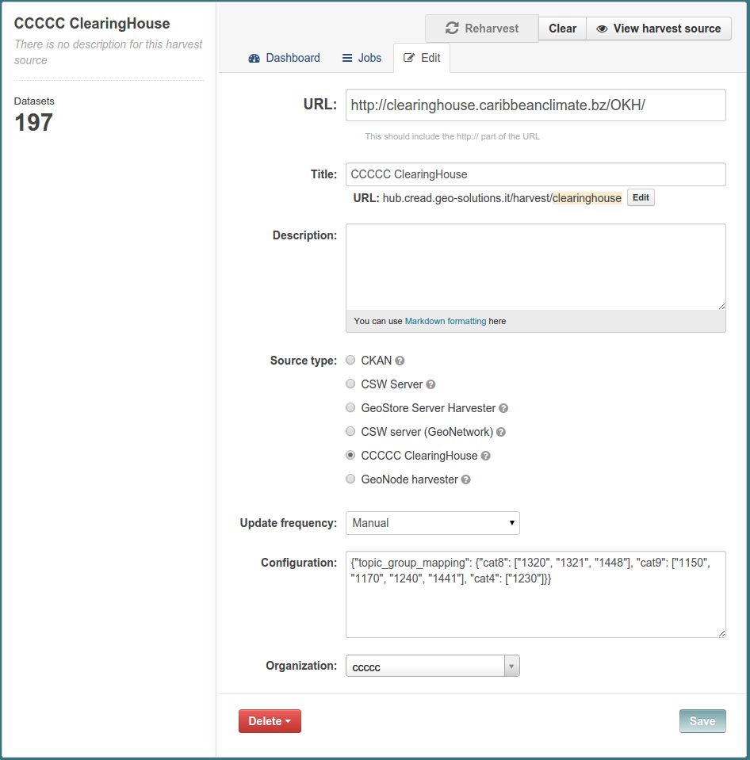

.. _ckan_harvest_cread:

##############################
Harvesting CCCCC ClearingHouse
##############################

This is the configuration page for the ClearingHouse harvester:

You can see the **source** type is set as `CCCCC ClearingHouse`.

We installed the plugin for this kind of harvester in :ref:`install_ext_harvesters_ccccc`.

For this kind of harvester you have to provide in the **URL** field 
the URL of service returning the harvestable set of datasets.

The **organization** is set to `ccccc`, so that we will be able to filter all the datasets gathered from 
the ClearingHouse at once.
 
As seen in the GeoNode harvester, also in this harvester we put in the JSON string the configuration for 
mapping some source codes into the corresponding CKAN groups code listed in :ref:`ckan_categories_list`.   

The JSON configuration is only partial and should be completed::

  {"topic_group_mapping": {
    "cat8": ["1320", "1321", "1448"], 
    "cat9": ["1150", "1170", "1240", "1441"], 
    "cat4": ["1230"]}}

A dataset will be assigned a given group if the harvested document has a category code in the related list.

For instance, if a remote document has a category ``1441``, it will be bound to the CKAN group with code ``cat9``.

    