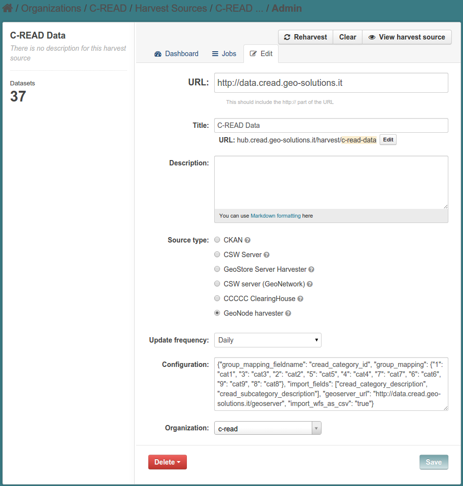

.. _ckan_harvest_cread:

#########################
Harvesting C-READ GeoNode
#########################

The GeoNode harvester uses the `GeoNode API <http://geonode.readthedocs.org/en/latest/reference/api.html>`_,
so it can be used only with GeoNode instances running one of the latest versions (">2.0"), having the API endpoints enabled.

.. note::
   Older GeoNode istances (e.g. `CARISKA <http://cariska.mona.uwi.edu/>`_ can be harvested using the CSW 
   harvester (or the GeoNetwork one).
   (look at :ref:`ckan_harvest_csw`).   

We installed the plugin for this kind of harvester in :ref:`install_ext_harvesters_geonode`.

This is the configuration page for the C-READ GeoNode harvester:

   
  
You can see the harvester **source** type is set as `GeoNode`.

For GeoNode harvesters, we have to put in the **URL** field the URL of the GeoNode main page.

The **organization** is set to `c-read`, so that we will be able to filter all the datasets gathered from 
the CREAD GeoNode at once.
 
A really important part of the configuration of the GeoNode harvester is the JSON **configuration** string.
As told, the configuration is specific to each different harvester. 
You can find the doc about this harvester at https://github.com/geosolutions-it/ckanext-geonode/wiki

This is the configuration string::

  {"group_mapping_fieldname": "cread_category_id", 
   "group_mapping": {
      "1": "cat1", 
      "3": "cat3", 
      "2": "cat2", 
      "5": "cat5", 
      "4": "cat4", 
      "7": "cat7", 
      "6": "cat6", 
      "9": "cat9", 
      "8": "cat8"}, 
   "import_fields": [
      "cread_category_description", 
      "cread_subcategory_description"], 
   "geoserver_url": "http://data.cread.geo-solutions.it/geoserver", 
   "import_wfs_as_csv": "true"}
   
The ``group_mapping_fieldname`` and ``group_mapping`` fields are used to map the C-CREAD categories from GeoNode into CKAN.

When harvesting GeoNode resources, GeoNode returns a JSON object which describes the resource.
``group_mapping_fieldname`` tells the name of the field that contains the information about the 
catagore, while ``group_mapping`` maps the value of such field into the code of the related group 
according to the codes in :ref:`ckan_categories_list`.

We are setting ``import_wfs_as_csv`` so that, when importing a vector layer metadata, also the data will
be imported as a CSV file. In this way, the attributes content will be browsable inside CKAN as a table.

