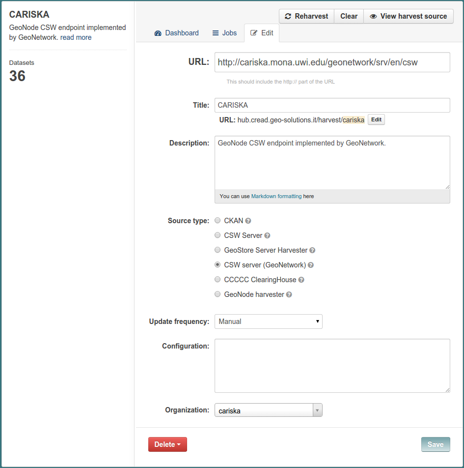

.. _ckan_harvest_csw:

######################
Harvesting CSW Sources
######################

`CSW <http://www.opengeospatial.org/standards/cat>`_ is a standard for the harvesting of spatial data.
CKAN provides a CSW harvester in the official `ckanext-spatial <https://github.com/ckan/ckanext-spatial>`_ extension.

The configured CSW harvester uses anyway the extension provided by the :ref:`install_ext_harvesters_geonetwork`, since 
we know that the CSW provider is a GeoNetwork instance.

This is the configuration page for the GeoNode CSW harvester:

You can see the **source** type is set as `CSW server (GeoNetwork)`. 
The standard CSW harvester is the one named "CSW Server". 

We installed the plugin for this kind of harvester in :ref:`install_ext_harvesters_geonetwork`.

For both the GeoNetwork and CSW harvesters you have to provide in the **URL** field 
the URL of service providing the CSW endpoint.

The **organization** is set to `CARISKA`, so that we will be able to filter all the datasets gathered from 
the CARISKA site at once.

You can find `here <https://github.com/geosolutions-it/ckanext-geonetwork/wiki#configuration>`_ the available 
configuration parameters that this harvester offers, including the description about how the category mapping can be set. 

    