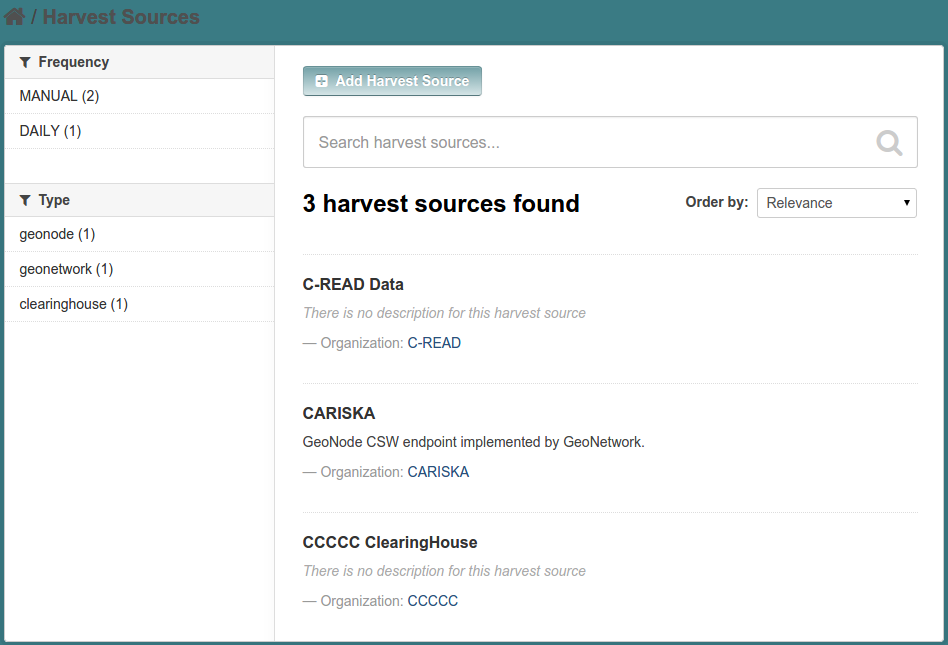
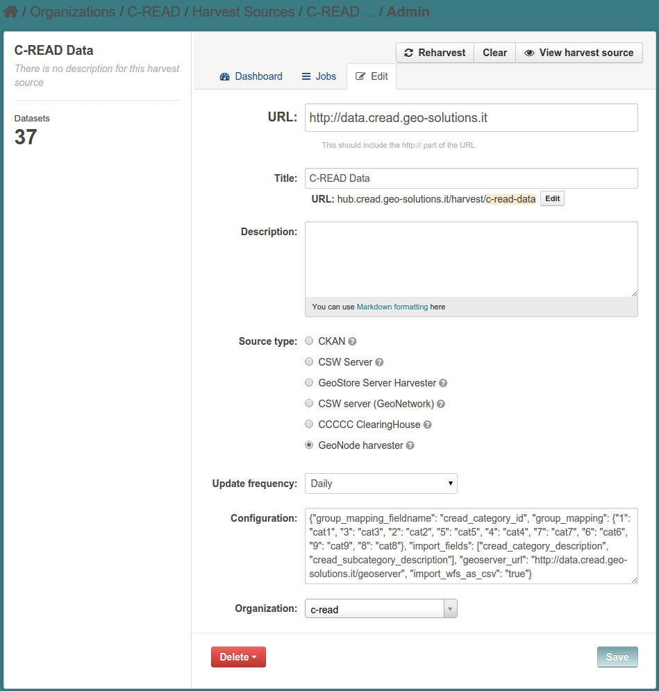

.. _ckan_harvesting:

########################
Harvesting configuration
########################

Introduction
============

In CKAN an `harvester` is a plugin that allow to read remote data and import them into CKAN.

Different types of source will offer different connection protocols, so we'll have to setup harvesters of different 
types. 

Setting up harvesters
=====================

The final CKAN layout is oriented toward the data consumer, so it does not have any explicit link 
to the `Harvester` page; You can get in there using this link

   http://hub.cread.geo-solutions.it/harvest

You can see there are 3 different harvest sources configured.

Let's take as example the GeoNode harvester pointing to the C-READ data node. 

The harvest setup page is the same for all the harvester.

You have a set of fields to fill in:

* The URL endpoint for the source to be harvested
* A title/name for this source, for your reference
* A code, that will be part of the URL referencing this harvester 
* A description
* The harvest type; this will choose the different harvester that will be run against the configured URL
* The update frequency
* An optional configuration in JSON format; the JSON configuration format is specific for every different harvester
* The owner Organization: all the dataset harvested from this source will be assigned to that Organization.
