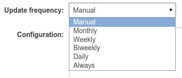
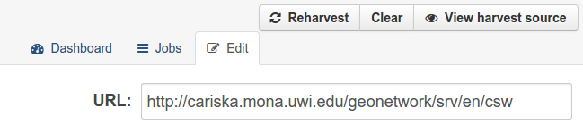

.. _ckan_harvesting_running:

######################
Running the harvesters
######################

In order to have an harvester to fetch the remote datasets, it should be run.

At each run 

- new datasets will be locally added, 
- remotely updated ones will be updated locally as well, and 
- old datasets that cannot be found anymore on the remote site will be locally deleted.  

You can configure the update frequency in this dropdown menu in the harvesting configuration page.   

A background script (installed at paragraph :ref:`install_ckan_harvesting_script`)
that runs every 15 minutes will look for any new reharvesting request and run the
related harvester if needed.

The choice **always** will try and run the selected harvester every time the 15 minutes script runs.
If the previous harvesting run is not finished yet, a new one will not be launched.

The harvesters with frequancy choices **Daily**, **Weekly**, ... will be examined by the script run every 15 minutes.
If the script finds that the last run was over a day ago (or one week, two weeks, etc, according to the choice),
the harvester will be run again.

Harvester with the **manual** choice will never be run automatically:
the harvester run can be triggered by pressing the "`Reharvest`" button in the harvester administration page:

When the "reharvest" button is pressed, the harvesting will run within the next 15 minutes. 
    

Frequency customizations
------------------------

You may have noted that the harvesting script that has been configured during the CKAN installation have been
slightly customized.

We added the line  containing the ``harvester job-all``, an additional command that will force harvesting from
all the configured sources.
This means that all harvesting sources will be handled as if they have the "Always" frequency set.

If you need some more fine-grained frequency, you should set up your own script, and tell ``cron`` to run it
whenever you need.

.. tip::
   For next instructions you may need some knowledge of the CKAN command line interface 
   (some details at :ref:`ckan_cli_paster`).

E.g. Let's say you want to run the clearinghouse harvester every 6 hours.
   
#. Find the code of the harvest source you want to run at your own frequency

   Log into the hub machine as user ``ckan`` and issue the commands::
   
      . /usr/lib/ckan/default/bin/activate 
      paster --plugin=ckanext-harvest harvester sources     --config=/etc/ckan/default/production.ini
            
   Last command will run the ``sources`` command on the ``harvester`` plugin. 
   You will get the list of the configured sources::
   
      [...]
   
      Source id: 874fefea-2378-44a3-8c63-3b1503e3d747
            url: http://cariska.mona.uwi.edu/geonetwork/srv/en/csw
           type: geonetwork
         active: True
      frequency: MANUAL
           jobs: 31

      Source id: 5a9bc86b-6769-43d6-86ed-2efc1176332d
            url: http://data.cread.geo-solutions.it
           type: geonode
         active: True
      frequency: DAILY
           jobs: 20

      Source id: 6feef051-71ee-4fc9-a548-bca2e34afd0a
            url: http://clearinghouse.caribbeanclimate.bz/OKH/
           type: clearinghouse
         active: True
      frequency: MANUAL
           jobs: 7
              
      There are 3 active harvest sources
      
   We see that the code for the clearinghouse harvester is ``6feef051-71ee-4fc9-a548-bca2e34afd0a``.   
         
#. Create a script for running your harvester
 
   Create a script ``/usr/lib/ckan/run_clearinghous.sh`` with this content::  

      . /usr/lib/ckan/default/bin/activate 
      paster --plugin=ckanext-harvest harvester job 6feef051-71ee-4fc9-a548-bca2e34afd0a --config=/etc/ckan/default/production.ini
      
   and make it executable ::
   
      chmod +x /usr/lib/ckan/run_clearinghouse.sh         

#. Tell cron to run your script

   Now we have to tell cron to run the script every 6 hours.
   Open the crontab in editing mode with ``crontab -e`` and add the line ::

      00 */6 * * * /usr/lib/ckan/run_clearinghouse.sh

#. Tell CKAN not to do anything else 

   Set the clearinghouse harvester update frequency to "manual", so that CKAN will not trigger
   the harvesting on its own.
   Now the harvesting will be run by the cronjob every 6 hour. Should you need an "extra" run of the harvester
   you may press the "reharvest" button whenever you like, and it will run within the next 15 minutes as usual.
  

      