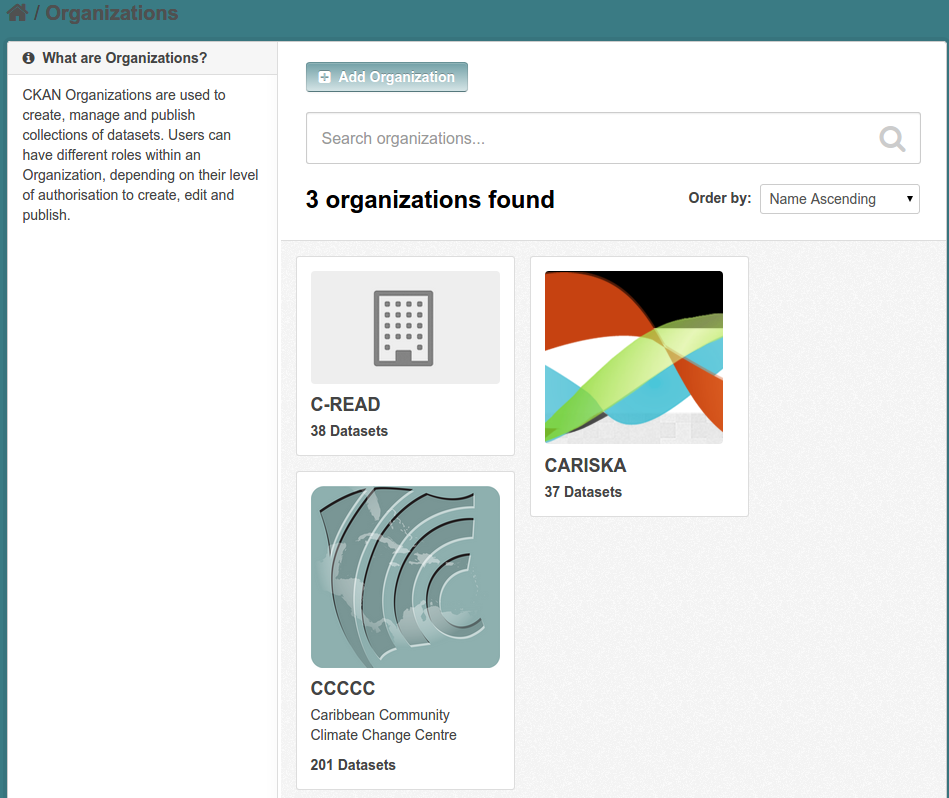
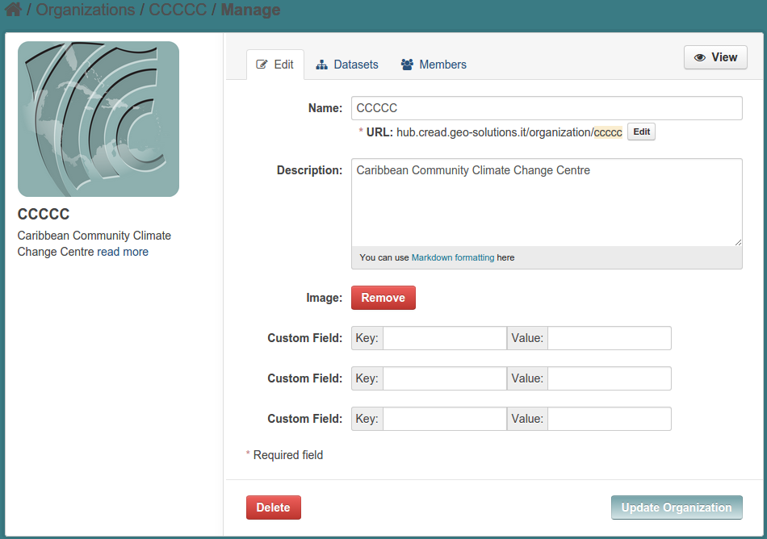

.. _ckan_setup_organizations:

###################
CKAN: Organizations
###################

Introduction
============

Organizations in CKAN are a way to assign privileges over datasets to different group of users.

A dataset may belong to at most one organization; in such case, users associated to that organization have some 
more control over the dataset than other users.  
  
In C-READ context we will use organizations only as a mean of categorization dataset, which will tell us where 
a dataset has been harvested from. 

Creating organizations
======================

The final CKAN layout does not have any explicit link to the `Organizations` page, but you can get in there    
using this link
   
   http://hub.cread.geo-solutions.it/organization
   
You will see the list of the configured organizations.
If you have logged in with admin credentials, you will see the `add` button:
   

   
There have been created as many organization as the sources we are harvesting from. 

Here is the first one:
    

      
When creating an organization, you have to set:

- a mandatory **name**
- an optional **code** that will be used to address the organization in the URLs. 
  If the URL is not edited, it will default to an encoded form of the name.
- an optional **description**
- an optional **image**

