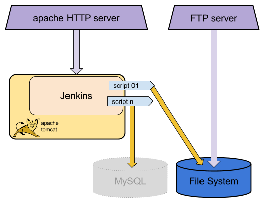

.. _processing_node_architecture:

#########################
Processing Node: Overview
#########################

The `C-READ Processing Node` runs `Jenkins <https://jenkins-ci.org/>`_, 
an application that monitors executions of repeated jobs.

There are also some required libraries installed on the system, such as the `GDAL utilities <http://www.gdal.org/>`_,
used to perform some basic data transformations. 

All the software used in this project is release under open source licences.
Namely:

 - `Jenkins <https://wiki.jenkins-ci.org/display/JENKINS/Governance+Document#GovernanceDocument-License>`_ v1.6
 - `GDAL <http://www.gdal.org/>`_ v1.11.2

This document provides information on how to setup a CentOS 7 machine with Jenkins
and GDAL to automate the download, processing and harvesting of new data into GeoNode.

Components overview
===================

This is the block diagram of the processing node:

